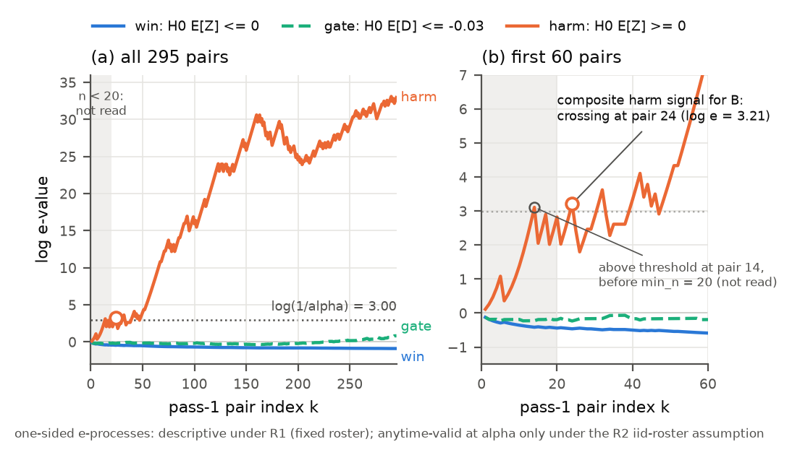
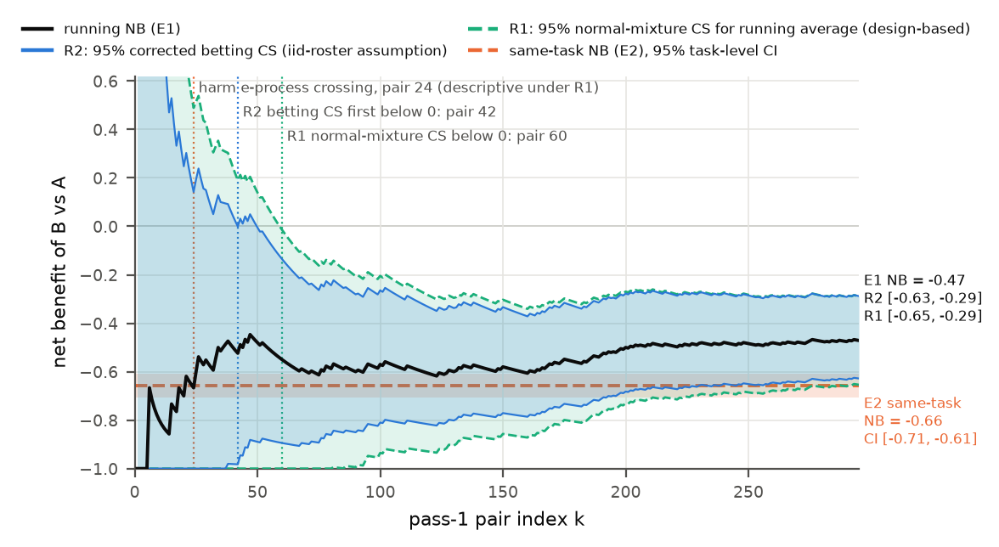

# Local-model prospective stream: report v3 (Round 9 + Round 10 re-analysis, POST HOC)

This report supersedes `report_v2.md` (preserved in `v2_pre_round10/`) and `v1_pre_round9/report.md` for every inferential statement. It was generated 2026-09-19T05:29:05Z by `experiments/local_stream/make_report_v3.py` from `summary_v2.json` (`analysis_v2.py`, E1 numbers) and `summary_v3.json` (`analysis_v3.py`, E2 cluster analysis, pass table, Round 10 labels), which re-analyse the **unchanged** raw evidence (`episodes.jsonl`, `monitor_pass1.csv`, `monitor_state.json`, `design.json`, `run_manifest.json`; sha256 in `analysis_v3_manifest.json`). No episode was re-run, no model was called and no generated program was executed. Everything here is **post hoc**: specified in `experiments/local_stream/protocol_addendum_round9.md` and `protocol_addendum_round10.md` after the outcomes were known, in response to the Round 9 and Round 10 audits of PR 8. The frozen `protocol.md` and `analysis.py` are untouched.

**Round 10 changes** (response to the Round 10 audit; raw data and every point estimate unchanged):

1. **E2 uncertainty relabelled.** The task-level t interval and the task-level Hoeffding interval are **model-based**: they need independent task scores with stable task-specific episode laws and no relevant pass/period effects (the t interval also a Lindeberg / variance-growth condition). They are not consequences of the two-pass AB/BA design, in which the two tasks of a design pair share one orientation coin. The v2 claims that these intervals were free of assumptions, or conservative by construction, are withdrawn (section 4, with the audit's two-task counterexample).
2. **Orientation-pair cluster analysis added** (G = 296 clusters: 295 design pairs + the unpaired task): cluster-robust SE 0.02488 versus task-level SE 0.02485 for the same-task NB (ratio 1.0012); exact final-time cluster Hoeffding radius 0.15794 (task-level, model-based: 0.11173). Independence across clusters is still an assumption.
3. **The -0.03 same-task success margin is not certified by any reported interval** (section 5).
4. **Descriptive pass/period table added** (section 4; no inference).
5. **R1 wording**: the target is the running conditional mean of the pair scores given a stated filtration; the pair-mean formula and the link to a roster-level target hold only under an additional stable episode-law model. Separate 95% intervals for NB and the success difference are not a joint 95% region; rho was fixed after outcomes were seen. **R2 wording**: unconditional model-based inference over hypothetical iid rosters, with a filtration that does not contain the whole realized roster; not a guarantee conditional on the curated benchmark. Fixed-stake e-process crossings stay descriptive under R1.
6. **Endpoint arithmetic of `src/wincs.py` repaired** (`0 * log 0 = 0`: a stake whose factor is 0 kills the capital only when its count is positive; new test `test_endpoint_normalization_round10`). Effect on the v2 numbers: no v2 number changed (largest absolute difference over 482 numeric leaves and 4256 CSV cells: 0).
7. **Anonymized data manifest** now committed at a non-ignored path (`release_anon/local_data_manifest.anon.json`); anonymized-copy regeneration is location-dependent (section 8).

## 1. Summary

Two workflows on one local open-weight model (`mlx-community/Qwen2.5-Coder-7B-Instruct-4bit`, served at `127.0.0.1`; no commercial or proprietary model call) were compared on a fixed roster of 591 tasks (427 MBPP-sanitized + 164 HumanEval): A `single_shot` versus B `self_test_repair`. All 1182 planned episodes were run and retained. **The preregistered primary hypothesis H1 (B has higher hidden-test success) is not supported, and this negative result is retained as is**: both arms succeeded on 433/591 tasks (40 B-only and 40 A-only successes). B used 2.96x the model calls, 7.42x the prompt tokens, 4.46x the completion tokens and 4.46x the mean workflow latency of A. Under the frozen hierarchy (success > latency at 10% tolerance > completion tokens, absorbing rule) the net benefit of B is negative on both prespecified contrasts: E1 cross-arrival NB = -0.471 (69 wins / 18 ties / 208 losses over 295 pairs) and E2 same-task NB = -0.657 (591 tasks; model-based task-level t interval [-0.705, -0.608], orientation-pair cluster-robust interval [-0.705, -0.608], exact cluster Hoeffding interval [-0.814, -0.499]; section 4).

Uncertainty for E1 is given under two explicitly separated readings (section 3): **R1**, 95% normal-mixture CS for the **running conditional mean** of the pair scores given the stated filtration (section 3) [-0.654, -0.288], first entirely below 0 at pair 60; **R2**, model-based (unconditional inference over hypothetical iid rosters with independent stable episode laws; unverifiable for a curated benchmark and not conditional on it), corrected 95% betting CS [-0.628, -0.288], first below 0 at pair 42. The online monitor outcome is a **composite harm signal for B; incumbent A retained** (harm e-process read above threshold at pair 24): an unfavourable result for B on the prespecified composite, driven by the latency tier; it is not a success-rate or safety harm and not a reverse guarded approval of A. The success guardrail was **not** certified online, and the same-task non-inferiority check passes by only 0.00025 under one model-based approximation and is **not certified by any reported interval** (section 5).

## 2. What changed relative to v1

| item | v1 (preserved in `v1_pre_round9/`) | v2 numbers (Round 9), Round 10 wording |
|---|---|---|
| two-sided betting CS | `max(K+, K-)` against `1/delta` (guarantee 2 delta) | hedged capital `(K+ + K-)/2` against `1/delta` (guarantee delta); `src/wincs.py` sha256 `601865d9adf0a9f1` |
| E1 NB interval | [-0.6184, -0.3008] | R2 [-0.6281, -0.2880]; R1 [-0.6540, -0.2883] |
| E1 success-difference interval | [-0.0698, 0.1707] | R2 [-0.0786, 0.1794]; R1 [-0.1320, 0.2337] |
| E1 win-ratio interval (decided pairs) | [0.2083, 0.5141] | R2 [0.2010, 0.5299] (no R1 analogue is claimed) |
| first pair at which the NB interval is below 0 | 32 (uncorrected CS) | R2: 42 (stays below from pair 50); R1: 60 |
| target of E1 | "295 independent pairs", population guarantee asserted | R1: running conditional mean of the pair scores (stated filtration); R2: theta_P under the iid-roster MODEL (unconditional) |
| monitor crossings | "valid decision after 24 independent pairs" | descriptive under R1; anytime guarantee only under R2 |
| label `B_harmful` | "B harmful" | "composite harm signal for B; incumbent A retained" |
| pass-1 component intervals | independent-arm Welch | pair-level differences (n = 295) |
| freeze wording | "before any model call" | "before design-task outcomes" (section 8) |
| resources | completion tokens and latency | prompt, completion and total tokens, model calls, latency per arm (section 6) |

Point estimates, tier decompositions, the e-process paths and the first-crossing indices are identical to v1 (asserted in `analysis_v2.py`); `task_scores.csv` and `episodes_flat.csv` do not depend on the CS and are unchanged. Regression check of the correction (`two_sided_cs_check.json`): for one fair +/-1 observation E max(K+, K-) = 1.06370423 > 1 while E (K+ + K-)/2 = 1.000000000000; simulated time-uniform miscoverage of the corrected CS over 2000 streams of length 2000 at delta = 0.05: 0.0100, 0.0105, 0.0100 (uncorrected max rule on the same streams: 0.0285, 0.0230, 0.0245).

## 3. E1: cross-arrival contrast (295 pass-1 pairs)

Sampling facts. The 591 tasks are a FIXED roster (R2 replaces this by a model). The design (seed 20260918) drew one uniformly random permutation and independent Bernoulli(1/2) orientations for 295 disjoint consecutive pairs; one arrival (`mbpp/256`) is unpaired by design and enters E2 only. Each episode adds model-sampling randomness. Pass 1 was physically executed in the frozen arrival order, one exposure per arrival; execution never stopped at a crossing.

Counts: 69 B wins / 18 ties / 208 B losses; NB = -0.4712; WR = 0.332; success difference D = 0.0508 (A 0.715, B 0.766 in pass 1). Tier decomposition: success 67 wins / 52 losses (0.051); latency_s 2 wins / 156 losses (-0.522); completion_tokens 0 wins / 0 losses (0.000).

| reading | target | conditions | procedure | NB, 95% | first n with upper bound < 0 | success difference, 95% | gate (lower > -0.03) |
|---|---|---|---|---|---|---|---|
| **R1** running conditional mean | (1/n) sum_{k<=n} mu_k with mu_k = E[Z_k \| F_(k-1)], F_k = sigma(design information independent of future outcomes, revealed pair data up to k) | bounded scores and the stated filtration; the target may move with n and with history (thermal state, order, caching). The reading mu_k = [m(s_k,t_k)+m(t_k,s_k)]/2 needs an ADDITIONAL orientation-independent, history-independent stable episode-law model and is not assumed | normal-mixture CS, V_n = n, rho = 100 fixed post hoc (radius 0.1828 at n = 295); no running intersection | [-0.6540, -0.2883] | 60 | [-0.1320, 0.2337] | not established |
| **R2** iid-roster model | theta_P = E m(s,t) for s, t iid from P | **MODEL: roster = iid sample from a task distribution P, independent stable episode laws, F = past revealed pair data + design information independent of future task values (not the whole realized roster). Unconditional inference over hypothetical rosters; NOT a guarantee conditional on the curated benchmark** | corrected hedged betting CS; decided-pair WR CS [0.2010, 0.5299] | [-0.6281, -0.2880] | 42 (stays below from 50) | [-0.0786, 0.1794] | not established (first n: none) |

Caption for the table. The R1 interval is a statement about the **running conditional mean** n^-1 sum mu_k, mu_k = E[Z_k | F_(k-1)], for the filtration F_k = sigma(design information independent of future outcomes, revealed pair data up to k); Z_k - mu_k is a martingale difference with conditional range 2, which is all the normal-mixture boundary uses. No running intersection is applied because this target can move with n. The interpretation mu_k = [m(s_k,t_k) + m(t_k,s_k)]/2, and with it E_design[mu_bar] = theta_N, holds **only under an additional orientation-independent, history-independent stable episode-law model**; thermal state, execution order and caching can affect latency, so that model is not assumed and **no statement about theta_N (and no without-replacement martingale or CS for it) is claimed**. The two separate 95% intervals (NB, success difference) are **not a joint 95% region**. rho = 100 is the library default but was fixed after the outcomes of this experiment had been seen (post hoc); these are post hoc analyses of a prespecified observed stream, not a prospectively chosen decision rule. The R2 row is unconditional model-based inference over hypothetical iid rosters, not a guarantee conditional on the curated benchmark. Definitions: `protocol_addendum_round10.md` (which supersedes the conflicting sentences of the Round 9 addendum).

Monitor (one-sided e-processes of `winstats.betting_log_e_ternary`, alpha 0.05, threshold log 20 = 2.996, read from pair 20; numerically unaffected by the two-sided fix): harm first read above threshold at **pair 24** (log e 3.209; it was above threshold at pair 14, log e 3.107, inside the prespecified n < 20 blackout, which is not read); final log e: harm 32.94, win -0.904, gate 0.812 (maxima -0.125 and 0.812; neither crossed). No deploy crossing.

- Under **R1** these crossings are reported **descriptively**: the fixed-stake e-processes test the pointwise conditional null (harm: mu_k >= 0 for every k), a stronger null than a non-negative running conditional mean or theta_N >= 0. No guarantee about the running conditional mean is claimed from a crossing (no new theorem is imported).
- Under the **R2 model** (with the coarse filtration stated above) they have the anytime type-I guarantee at alpha for theta_P; this is model-based, not conditional on the curated roster.
- Outcome label: **composite harm signal for B; incumbent A retained**. Unfavourable result for B on the prespecified COMPOSITE (driven by the latency tier); not a success-rate or safety harm, and not a reverse guarded approval of A: A is retained as the incumbent.
- The crossing is a recorded decision that could have been taken; the run was not stopped and nothing was deployed.



*Figure 1. Log e-values of the win, guardrail (gate) and harm e-processes after each pass-1 pair (`monitor_pass1.csv`); dotted line log(1/alpha); shaded region n < 20 is not read. These one-sided paths are descriptive under R1 and carry their anytime guarantee only under the R2 iid-roster model. The marked crossing is the composite harm signal for B (incumbent A retained), not a success-rate or safety harm. (Figure files are those of Round 9; the raw paths are unchanged.)*



*Figure 2. Running cross-arrival net benefit with (blue) the corrected 95% hedged betting CS, valid for theta_P under the R2 iid-roster model, and (green, dashed) the 95% normal-mixture CS for the **running conditional mean** of the pair scores (R1; the legend text "design-based" in the Round 9 figure file is to be read with this wording); orange: same-task NB with its 95% task-level t interval, which is MODEL-BASED (section 4). Source: `running_cs_v2.csv`, `summary_v2.json`.*

Pass-1 component contrasts from pair-level differences d_k = X_B,k - X_A,k (n = 295). The t intervals are **approximate and model-based**: they need (conditionally) independent pair differences, finite moments and a CLT regularity condition; latency and token differences are not bounded scores, and history dependence (thermal state, caching) is not excluded by the design.

| component | mean A | mean B | mean difference [95%] |
|---|---|---|---|
| success | 0.715 | 0.766 | 0.051 [-0.022, 0.124] |
| latency_s | 2.666 | 12.609 | 9.942 [8.936, 10.949] |
| completion_tokens | 66.769 | 317.715 | 250.946 [225.275, 276.616] |
| prompt_tokens | 117.169 | 877.658 | 760.488 [687.377, 833.599] |
| n_llm_calls | 1.000 | 2.912 | 1.912 [1.799, 2.024] |

## 4. E2: same-task shadow contrast (all 591 roster tasks, one A and one B episode each)

| scope | n tasks | p_win / p_tie / p_loss | NB [95% task-level t interval, MODEL-BASED] | WR [95%, model-based] |
|---|---|---|---|---|
| pooled | 591 | 0.069 / 0.205 / 0.726 | -0.657 [-0.705, -0.608] | 0.096 [0.069, 0.132] |
| mbpp | 427 | 0.070 / 0.239 / 0.691 | -0.621 [-0.679, -0.562] | 0.102 [0.070, 0.148] |
| humaneval | 164 | 0.067 / 0.116 / 0.817 | -0.750 [-0.838, -0.662] | 0.082 [0.044, 0.153] |
| stratified, equal benchmark weight | 591 | 0.069 / 0.177 / 0.754 | -0.685 [-0.738, -0.633] | 0.091 [0.064, 0.130] |

**Status of the task-level intervals (Round 10).** The task-level t interval and the task-level Hoeffding interval are **MODEL-BASED**. They are valid under *independent task scores with stable task-specific episode laws and no relevant pass/period effects*; the t interval additionally needs a Lindeberg / variance-growth regularity condition (boundedness alone does not give a CLT: for independent S_t ~ Bernoulli(1/N) all 591 scores are 0 with probability 0.367568 and the zero-width t interval then misses the mean) and is approximate. Under that model the identity E[s^2/N] = Var(mean) + (1/(N(N-1))) sum_t (tau_t - tau_bar)^2 holds and the Hoeffding radius sqrt(2 log(2/alpha)/N) = 0.11173 is exact at the final time. **Neither is a property of the actual two-pass design**: the pass in which each workflow sees a task is assigned by an orientation coin that is SHARED by the two tasks of a design pair, and all episodes share one machine. With dependent scores E[s^2/N] acquires the extra term -2 sum_{i<j} Cov(S_i, S_j) / (N(N-1)).

**Counterexample (Round 10 audit, finding 1).** Two tasks forming one design pair; both workflows are identical within a task and period. Task 1 succeeds in pass 1 and fails in pass 2; task 2 fails in pass 1 and succeeds in pass 2. Under one fair AB/BA orientation the two same-task success scores are (1, 1); under the other they are (-1, -1). Each task's mean score is 0, but Var((S1+S2)/2) = 1 while s^2/2 = 0 in both realizations. No model noise is needed: positive covariance inside the orientation pair defeats the variance identity; in general E[s^2/N] acquires the extra term -2 sum_{i<j} Cov(S_i,S_j) / (N(N-1)).

**Orientation-pair cluster analysis.** Clusters: the 295 design pairs of `design.json` (two tasks that shared one AB/BA coin and complementary pass positions) plus the singleton unpaired task `mbpp/256`; G = 296. Target: the **assignment-averaged same-task preference over the roster**, (1/591) sum_t E[S_t], the expectation taken over the orientation coins and episode randomness. Estimator: total same-task score / 591. (a) Cluster-robust variance by linearization with cluster totals, e_g = T_g - n_g NB_hat, var = G/(G-1) sum e_g^2 / 591^2, t reference on G - 1 = 295 df, **approximate**. (b) Exact range-based final-time Hoeffding bound under independent clusters, radius sqrt(2 (4*295 + 1) log(2/alpha)) / 591 = 0.15794. **Independent clusters is still an assumption**: arbitrary dependence inside a design pair is allowed, but dependence across clusters through shared machine state (thermal, cache, server history) is not excluded by the design. Per-cluster data: `e2_cluster_v3.csv`.

| quantity | estimate | task-level SE | task-level t 95% (model-based, approximate) | task-level Hoeffding 95% (model-based) | cluster-robust SE (G = 296) | cluster t 95% (approximate; independent clusters) | cluster Hoeffding 95% (exact; independent clusters) |
|---|---|---|---|---|---|---|---|
| same-task NB | -0.6565 | 0.02485 | [-0.7053, -0.6077] | [-0.7682, -0.5448] | 0.02488 | [-0.7055, -0.6076] | [-0.8145, -0.4986] |
| same-task success difference (B - A) | 0.0000 | 0.01515 | [-0.0297, 0.0297] | [-0.1117, 0.1117] | 0.01497 | [-0.0295, 0.0295] | [-0.1579, 0.1579] |

The cluster-robust SE is 1.0012 times the task-level SE for NB and 0.9883 times for the success difference; the observed within-pair correlation of the two task scores is 0.0008 (descriptive). In this sample the known orientation-pair dependence is therefore numerically immaterial for the t-type intervals, but that is an empirical observation, not a guarantee; the exact bound that does not rely on it is the cluster Hoeffding interval, which is wider (0.15794 versus 0.11173). Mean same-task score by exposure order (descriptive): A first then B -0.661 (295 tasks), B first then A -0.652 (296 tasks).

Under the iid-roster model the task-level t interval is also the conventional task-clustered interval for theta_task,P = E_{t~P} tau_t; that reading is model-based in the same sense as R2.

**Pass/period table (DESCRIPTIVE; no inference claimed; `pass_effects_v3.csv`).** For a given variant the pass-1 and pass-2 episodes are on different tasks (a random split of the roster), so a difference mixes task composition with any period effect.

| variant | episodes pass 1 / pass 2 | success rate pass 1 | pass 2 | diff (2 - 1) | mean latency (s) pass 1 | pass 2 | diff | mean completion tokens pass 1 | pass 2 | diff |
|---|---|---|---|---|---|---|---|---|---|---|
| A `single_shot` | 295 / 296 | 0.7153 | 0.7500 | 0.0347 | 2.666 | 2.933 | 0.266 | 66.8 | 73.6 | 6.9 |
| B `self_test_repair` | 296 / 295 | 0.7669 | 0.6983 | -0.0686 | 12.589 | 12.363 | -0.226 | 317.2 | 309.1 | -8.1 |

Reading aid (descriptive): the task set seen by A in pass 1 is the set seen by B in pass 2 (success 0.715 for A, 0.698 for B), and the set seen by B in pass 1 is the set seen by A in pass 2 (success 0.767 for B, 0.750 for A); the success-rate differences between passes within a variant therefore largely track which half of the roster was exposed, and period effects on latency are not separately identified.

Tier contribution means: success 0.000, latency_s -0.655, completion_tokens -0.002. Same-task paired component differences (B - A, n = 591 tasks; task-level t intervals, **model-based and approximate** as above; latency and token differences additionally need finite-moment CLT conditions):

| component | mean A | mean B | mean difference [95%] | ratio of means |
|---|---|---|---|---|
| success | 0.733 | 0.733 | 0.000 [-0.030, 0.030] | 1.00 |
| latency_s | 2.800 | 12.476 | 9.676 [9.090, 10.262] | 4.46 |
| completion_tokens | 70.205 | 313.178 | 242.973 [228.506, 257.439] | 4.46 |
| prompt_tokens | 120.504 | 893.724 | 773.220 [723.452, 822.987] | 7.42 |
| n_llm_calls | 1.000 | 2.958 | 1.958 [1.878, 2.037] | 2.96 |

## 5. Guardrail precision, and E1 versus E2

- Same-task success difference 0.000 (40 B-only, 40 A-only successes). Lower ends of the four reported 95% intervals: task-level t -0.029749 (model-based, approximate; clears the -0.03 margin by only **0.000251**), orientation-pair cluster-robust t -0.029460 (approximate, independent clusters; slack 0.000540), task-level Hoeffding -0.1117 (model-based), cluster Hoeffding -0.1579 (exact under independent clusters). **The -0.03 margin is NOT certified by any of these intervals**: the two t-type intervals clear it by less than 0.001 and only under assumptions that the design does not guarantee plus a normal approximation; both exact bounds reach far below it. The online gate e-process did not cross (final log e 0.812 against 2.996), and the online success-difference intervals reach -0.079 (R2 model) and -0.132 (R1). **This is not a non-inferiority result**; the data do not certify a 3-percentage-point success guardrail, online or same-task.
- E1 NB -0.4712 versus E2 NB -0.6565: difference 0.185. DESCRIPTIVE ONLY: different targets, shared episodes (pass-1 episodes enter both), different unit counts and exposure passes; no joint uncertainty is claimed for the difference. The tier and tie patterns that accompany the two numbers (v1 report section 6, unchanged counts) are descriptive context, not an established population difference, a causal mechanism or an efficiency comparison.

## 6. Resources per arm (recomputed from `episodes.jsonl`; `resources_v2.csv`)

| arm | episodes | successes | model calls | prompt tokens | completion tokens | total tokens | latency sum (s) | latency mean / median (s) | executions incl. hidden verifier | agent self-test executions |
|---|---|---|---|---|---|---|---|---|---|---|
| A `single_shot` | 591 | 433 | 591 | 71,218 | 41,491 | 112,709 | 1,654.6 | 2.7997 / 2.079 | 591 | 0 |
| B `self_test_repair` | 591 | 433 | 1,748 | 528,191 | 185,088 | 713,279 | 7,373.4 | 12.4761 / 10.131 | 1,748 | 1,157 |
| total | 1182 | | 2,339 | 599,409 | 226,579 | 825,988 | | | | |

B/A ratios: model calls 2.96, prompt tokens 7.42, completion tokens 4.46, total tokens 6.33, mean latency 4.46. Completion tokens are **generation counts, not dollars, energy or total compute**; prompt tokens are shown because B consumes 7.4x as many. No token count is marked estimated. `n_executions` **includes the one hidden-verifier execution per episode**, whereas `latency_s` (model calls + the workflow's own self-tests) excludes hidden verification; verifier operations are not agent tool calls. Latency is single-host, sequential, local-server workflow latency on the recorded hardware, not queueing or production latency; these ratios are for this run only.

## 7. Decision rules and sensitivity (corrected CS; `decision_rules_v3.csv`, `sensitivity_v2.csv`)

| rule | data | reading / status | estimate | 95% interval | outcome |
|---|---|---|---|---|---|
| success_only | shadow | E2 task-level, MODEL-BASED (independent task scores, stable episode laws, no pass/period effects; t interval approximate) | 0.000 | [-0.030, 0.030] | none |
| pareto_means | shadow | E2 task-level, MODEL-BASED (independent task scores, stable episode laws, no pass/period effects; t interval approximate) | - | - | A |
| utility_w=1.00/0.00/0.00 | shadow | E2 task-level, MODEL-BASED (independent task scores, stable episode laws, no pass/period effects; t interval approximate) | 0.000 | - | none |
| utility_w=0.80/0.10/0.10 | shadow | E2 task-level, MODEL-BASED (independent task scores, stable episode laws, no pass/period effects; t interval approximate) | -0.692 | - | A |
| utility_w=0.60/0.20/0.20 | shadow | E2 task-level, MODEL-BASED (independent task scores, stable episode laws, no pass/period effects; t interval approximate) | -1.383 | - | A |
| utility_w=0.50/0.25/0.25 | shadow | E2 task-level, MODEL-BASED (independent task scores, stable episode laws, no pass/period effects; t interval approximate) | -1.729 | - | A |
| utility_w=0.34/0.33/0.33 | shadow | E2 task-level, MODEL-BASED (independent task scores, stable episode laws, no pass/period effects; t interval approximate) | -2.283 | - | A |
| utility_w=0.20/0.40/0.40 | shadow | E2 task-level, MODEL-BASED (independent task scores, stable episode laws, no pass/period effects; t interval approximate) | -2.767 | - | A |
| hierarchical_nb | shadow | E2 task-level, MODEL-BASED (independent task scores, stable episode laws, no pass/period effects; t interval approximate) | -0.657 | [-0.705, -0.608] | A |
| guarded_hierarchical | shadow | E2 task-level, MODEL-BASED (independent task scores, stable episode laws, no pass/period effects; t interval approximate) | -0.657 | [-0.705, -0.608] | A |
| conjunction_all_components | shadow | E2 task-level, MODEL-BASED (independent task scores, stable episode laws, no pass/period effects; t interval approximate) | - | - | none |
| hierarchical_nb_betting_cs | online | R2 (iid-roster MODEL; unconditional, not conditional on the curated benchmark) | -0.471 | [-0.628, -0.288] | A |
| guarded_anytime | online | R2 (iid-roster MODEL; unconditional, not conditional on the curated benchmark) | -0.471 | [-0.628, -0.288] | retain A |
| success_only_betting_cs | online | R2 (iid-roster MODEL; unconditional, not conditional on the curated benchmark) | 0.051 | [-0.079, 0.179] | none |
| hierarchical_nb_normal_mixture_cs | online | R1 (running conditional mean given the stated filtration; POST HOC) | -0.471 | [-0.654, -0.288] | A |
| success_only_normal_mixture_cs | online | R1 (running conditional mean given the stated filtration; POST HOC) | 0.051 | [-0.132, 0.234] | none |
| hierarchical_nb_cluster_robust_t | shadow | E2 orientation-pair clusters (G = 296), APPROXIMATE, independent clusters assumed | -0.657 | [-0.705, -0.608] | A |
| hierarchical_nb_cluster_hoeffding | shadow | E2 orientation-pair clusters, exact final-time Hoeffding, independent clusters assumed | -0.657 | [-0.814, -0.499] | A |
| success_only_cluster_robust_t | shadow | E2 orientation-pair clusters (G = 296), APPROXIMATE, independent clusters assumed | 0.000 | [-0.029, 0.029] | none |
| success_only_cluster_hoeffding | shadow | E2 orientation-pair clusters, exact final-time Hoeffding, independent clusters assumed | 0.000 | [-0.158, 0.158] | none |

"A" in the outcome column means the rule's interval or point estimate favours A on that rule's own criterion; for `guarded_anytime` the outcome is "retain A" (composite harm signal), which is not a guarded approval of A. Success-only rules return no decision. All shadow-data rows are model-based (section 4); the four `*_cluster_*` rows are the Round 10 orientation-pair cluster intervals. An "A" outcome of a fixed-horizon rule is not a validated reverse deployment approval of A.

| tol | order | eligibility | E2 NB [95% task-level t, model-based] | E1 NB [R2 corrected CS] | online label |
|---|---|---|---|---|---|
| 0.0 | success > latency_s > completion_tokens | absorbing | -0.662 [-0.710, -0.613] | -0.475 [-0.631, -0.291] | composite harm signal for B; incumbent A retained |
| 0.0 | success > completion_tokens > latency_s | absorbing | -0.662 [-0.710, -0.613] | -0.475 [-0.631, -0.291] | composite harm signal for B; incumbent A retained |
| 0.0 | latency_s > success > completion_tokens | none | -0.997 [-1.003, -0.990] | -0.959 [-1.000, -0.871] | composite harm signal for B; incumbent A retained |
| 0.0 | completion_tokens > success > latency_s | none | -0.997 [-1.003, -0.990] | -0.959 [-1.000, -0.871] | composite harm signal for B; incumbent A retained |
| 0.1 | success > latency_s > completion_tokens | absorbing | -0.657 [-0.705, -0.608] | -0.471 [-0.628, -0.288] | composite harm signal for B; incumbent A retained |
| 0.1 | success > completion_tokens > latency_s | absorbing | -0.657 [-0.705, -0.608] | -0.471 [-0.628, -0.288] | composite harm signal for B; incumbent A retained |
| 0.1 | latency_s > success > completion_tokens | none | -0.992 [-1.000, -0.983] | -0.956 [-1.000, -0.867] | composite harm signal for B; incumbent A retained |
| 0.1 | completion_tokens > success > latency_s | none | -0.992 [-1.000, -0.983] | -0.956 [-1.000, -0.867] | composite harm signal for B; incumbent A retained |
| 0.2 | success > latency_s > completion_tokens | absorbing | -0.658 [-0.707, -0.610] | -0.461 [-0.618, -0.278] | composite harm signal for B; incumbent A retained |
| 0.2 | success > completion_tokens > latency_s | absorbing | -0.658 [-0.707, -0.610] | -0.461 [-0.618, -0.278] | composite harm signal for B; incumbent A retained |
| 0.2 | latency_s > success > completion_tokens | none | -0.992 [-0.999, -0.984] | -0.925 [-0.993, -0.824] | composite harm signal for B; incumbent A retained |
| 0.2 | completion_tokens > success > latency_s | none | -0.992 [-0.999, -0.984] | -0.919 [-0.988, -0.814] | composite harm signal for B; incumbent A retained |

## 8. Hypotheses, provenance and wording corrections

- **H1 not supported (retained negative result).** H2 (B costs more latency and tokens) supported. H3 (hierarchy prefers B) refuted on both contrasts. H4: resource-first orders also favour A; the predicted disagreement was not observed. H5: not robustly established (section 5). No new variants were run and none are proposed as a completion criterion.
- **Freeze wording.** The protocol and design were frozen **before design-task outcomes**, not "before any model call": smoke checks and the 6-task out-of-design timing pilot (full MBPP, disjoint from the design, never analysed) called the model earlier and are disclosed. This is a timestamped internal freeze, not an external registration.
- **Harness commits.** The run manifest and every episode record harness commit `526dff7b6d26f818964611b9ccbd8f61fae2e43c`; protocol section 16 names freeze commit `d9793d56430e65c600e241f325a7cd540d23a668`. Per the Round 9 audit's Git reconciliation, all 13 recorded file hashes match `526dff7b`, and at `d9793d5` only `protocol.md` differs (the other 12 files are identical); both commits precede the first episode. (This report did not run git; the reconciliation is the audit's, and it agrees with the per-file sha256 comparison in the v1 report section 10.)
- **Exposure.** Coding pass 1 is a physically executed, randomized, sequential laboratory stream with fresh generations; crossings are recorded, not acted on; there are no production users.
- **Data provenance** (`data_manifest.json`, checked by `verify_data_manifest.py --verify-pinned`): MBPP-sanitized pinned at `google-research/google-research@f82046ba5aab` (255053 bytes, sha256 `ca95deaa9a01ef0a`, CC-BY-4.0); HumanEval pinned at `openai/human-eval@463c980b59e8` (44877 bytes, sha256 `b796127e635a67f9`, MIT); full MBPP (timing pilot only) at `@f82046ba5aab` (563743 bytes, sha256 `ccf64ceae9c5403b`). Re-fetching the pinned URLs gave identical bytes (2026-09-18T20:27:08Z); the canonical task list rebuilds to sha256 `23727895971fa4a040198d8770173a4f0c3263a63a9cb1479abc4203bb01c2ce`, the value stamped in `design.json`.
- **Anonymized release copies** of manifests/config/README/protocol with `<REPO>`, `<HOME>`, `<TMP>` placeholders and the sha256 of each original: `release_anon/` (`MAPPING.md`). Originals are not edited. Round 10: the sanitized copy of the git-ignored local data manifest is now at the non-ignored path `release_anon/local_data_manifest.anon.json` (the Round 9 copy sat under an ignored `work/` directory and was never committed). Regeneration of the anonymized copies depends on the executing account and repository location (the strings to replace are derived at run time), so **no byte-for-byte portability of the anonymized copies is claimed**; `original_sha256` in `MAPPING.json` ties each copy to its original. The copies are a scoped allowlist, not approval to publish the whole branch anonymously.
- Unchanged descriptive material (failure accounting, latency scope, tier/tie tables, requirement checklist) remains in `v1_pre_round9/report.md` sections 6, 7, 11; where that text says "independent pairs", "valid decision", "B harmful" or "Welch", read it with the corrections above. Scope limits are unchanged: one 7B 4-bit model, one machine, public benchmarks with likely training overlap; benchmark success is not exhaustive correctness.

## 9. Reproducibility

```
.venv/bin/python experiments/local_stream/run_v3_all.py                  # endpoint tests + v2 numerics + v3 analysis/report from the preserved raw files (CPU only, no model)
.venv/bin/python experiments/local_stream/run_v3_all.py --with-cs-check  # also re-runs the Round 9 Monte Carlo CS check (about 3 more minutes)
```

Input, code and output hashes with timestamps: `analysis_v3_manifest.json`; comparison of the regenerated v2 numbers with the Round 9 files: `v2_vs_v3_numeric_check.json`. Round 9 outputs as committed before this repair: `v2_pre_round10/`; v1 outputs: `v1_pre_round9/`.
