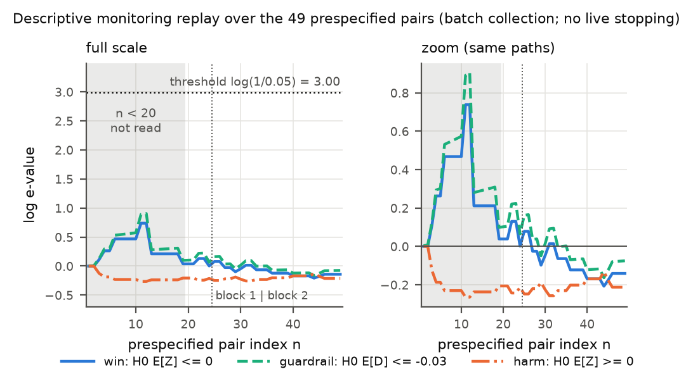
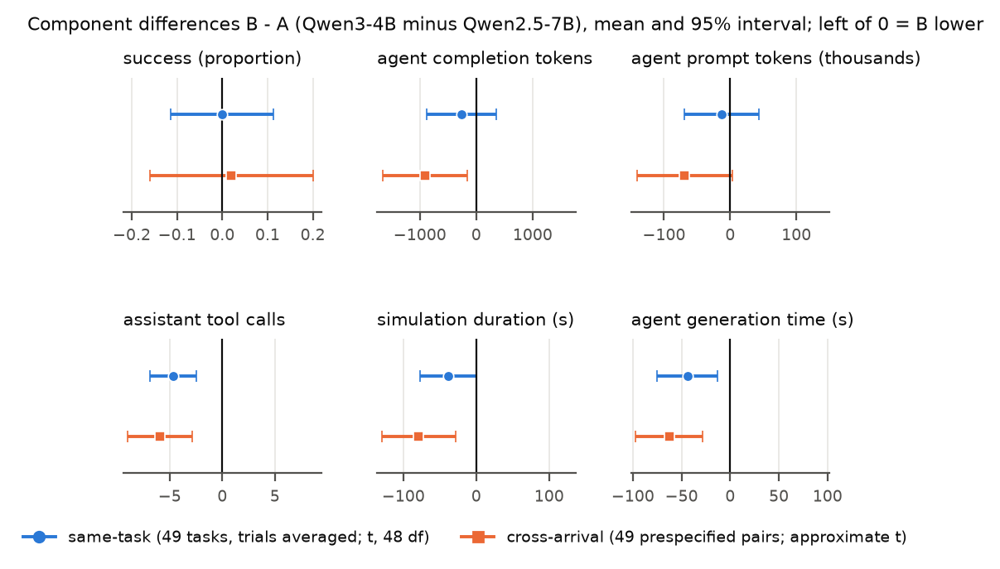
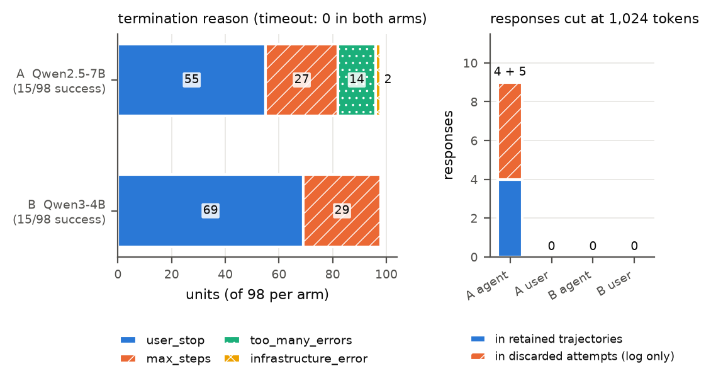

# tau2-bench airline, open-weight agents: final report

Written 2026-09-19 after the collection finished (invocation `0bf28fc9101f442a806c625dbdbe47c7`, status `completed`, 2026-09-19T04:56:43Z). This report interprets the frozen analysis; it does not replace `report.md`, which is kept exactly as `analysis.py` produced it. Binding documents, in order of precedence: `experiments/tau2_open/protocol_addendum_round12.md` (Round 12/13: governs wherever it conflicts with anything below, including withdrawn Round 10 wording), then `experiments/tau2_open/protocol_addendum_round10.md` and `experiments/tau2_open/deviation_1_erratum.md` (Round 10 wording correction: both were added on 2026-09-19 after the root session's Round 10 audit and narrow several claims below; every sentence changed for that reason is marked "Round 10 wording correction", and section 12 is the Round 10 addendum), `experiments/tau2_open/protocol_addendum_round9.md` (wording and scope of claims), `experiments/tau2_open/protocol.md` (frozen pre-registration, revision 2), `experiments/tau2_open/deviation_1_runaway_generation.md` with `config_amendment_1.json` (post-freeze operational amendment). No frozen file and no raw file was edited for this report; no model, API or git command was used to write it.

Number sources. `S` = `results/tau2_open/summary.json` (frozen `analysis.py`); `D` = `decision_rules.csv`; `V` = `sensitivity.csv`; `M` = `run_manifest.json`; `P` = `monitor_pass1.csv` / `monitor_state.json`; `N` = `results/tau2_open/report_final_numbers.json`, written by the new script `experiments/tau2_open/make_figures_final.py` directly from the raw tau2 JSONs (`raw/tau2_open_arm{A,B}.json`), `episodes.csv` and the logs; `L` = `results/tau2_open/logs/`. The script asserts that its re-computation of the E1 and E2 net benefit, their intervals and the per-arm success counts equals `S`.

Arms: A = agent `qwen2.5-7b-instruct` (Qwen2.5-7B-Instruct, Q4_K_M, incumbent); B = agent `qwen3-4b-instruct-2507` (Qwen3-4B-Instruct-2507, Q4_K_M, candidate). The user simulator is `qwen2.5-7b-instruct` in both arms. All scores are B versus A (+1 = B preferred); all differences are B - A.

> **Round 13 owner-document cleanup (2026-09-19).** This file is `report_final_v2.md` (reviewed and accepted for the named Round 12 corrections by the root session at `01f2381`, review on main at `a2eee58`: `reviews/round13_integration_disposition.md`; kept byte-unchanged) with the 9 precision replacements of `experiments/tau2_open/make_report_final_v3.py`. No model was run, no analysis was rerun and no number, table or figure changed. Verification chronology: `reviews/session60_round12_report_corrections_verification.md` describes the files BEFORE the five late fixes (its hashes and diff counts are historical); the committed v2 files were verified by the root's Round 13 reviews (`reviews/round13_owner_report_inference_review.md`, `reviews/round13_report_provenance_review.md`). This v3 file has been checked by its generator assertions only.

> **Round 12 report-only correction (2026-09-19).** This file is `report_final.md` (reviewed by the root session at `55fb1e5`; kept byte-unchanged) with the wording replacements and status pointers listed below and this status section added (Round 12: 15 declared replacements and six local status pointers; Round 13: the further replacements of `make_report_final_v3.py`), in response to the root session's Round 12 review (integration commit `45e8ee2` on main; `reviews/round12_integration_ledger.md`, `reviews/round12_airline_inference_review.md`). No model was run, no analysis was rerun, no observation, table or figure changed. Script: `experiments/tau2_open/make_report_final_v2.py`; source / output hashes and sha256 digests of each replaced passage: `report_final_v2_manifest.json` and `report_final_v3_manifest.json` (the passage text itself is in the generators `make_report_final_v2.py` and `make_report_final_v3.py`); binding wording: `experiments/tau2_open/protocol_addendum_round12.md`.

## 0. Round 12 status of every kind of statement in this report

| kind of statement | where | status |
|---|---|---|
| Canonical counts and means: 196 units, 194 saved trajectories, 2 infrastructure placeholders scored as failures, 15/98 successes per arm, replay 10 / 30 / 9, same-task 28 / 141 / 27, per-arm token, tool-call and time means, terminations, all-attempt accounting (206 attempts, 12 discarded) | sections 1, 3, 7, 12.3 | **Descriptive observations.** Accepted by the root as descriptive collection results. Reward labels are the archived tau2 labels (124 user-stop trajectories with a reward basis, 70 termination-based zeros, 2 missing), not independent re-adjudications. |
| Observed-array replay band for the orientation-averaged target | section 12.1 | **Optional post hoc illustration**, conditional on the full retained array and the matching, under nominal independent fair replay coins with collection, amendment and retention independent of the coins. The target is already computable from the array. Marginal bands, not joint. No new-task, fresh-run, production or stopping-gain inference. |
| Corrected betting CS for E1 (fixed mean), decided-pair win-ratio CS, task-clustered t intervals for E2 and for components, the independent-arm Welch intervals printed by the frozen `report.md`, H1-H5 verdicts that rest on those intervals | sections 3, 4, 5, 7.2, 8, 10 | **Model-dependent; assumptions not established by the design; excluded from the root integration.** Kept here for the record of the prespecified analysis. They are not to be read as supporting any conclusion beyond the descriptive rows above. |
| Decisions derived from intervals or sensitivity variants (decision-rule table and hierarchy / tolerance sensitivity in section 4, infrastructure-exclusion sensitivity in section 7.2, omit-five sensitivity in section 12.4), and the interval-based ratings of sections 8 and 10 | sections 4, 7.2, 8, 10, 12.4 | **Model-dependent and post hoc where marked; excluded from the root integration.** They are outputs of the stated rules on these data, separate from the descriptive observations. |
| Resource comparison | sections 1, 3.3, 7.3 | Descriptive means of canonical records only. No significance claim; canonical totals omit discarded attempts, and complete failed-attempt usage is unavailable. No operational-saving conclusion. |
| Provenance | sections 6, 7.5, 9, 12.5 | The actual sampler receipt, an immutable decision chronology for deviation 1 and complete failed-attempt usage remain **unverified**. No fresh-run, production, equivalence or operational-saving conclusion follows from this report. |

## 1. Summary

All 196 planned episodes (49 airline tasks x 2 trials x 2 arms) exist and are retained. **Descriptive observations (canonical retained records).** Both arms succeeded on 15 of 98 units (15.3%) (N, S); the same-task success difference is 0.000. Under the frozen hierarchy (success > agent completion tokens at 5% relative tolerance > assistant tool calls, absorbing rule): cross-arrival replay (E1, 49 prespecified pairs) 10 wins / 30 ties / 9 losses, NB = 0.020; same-task contrast (E2, 196 comparisons in 49 task clusters) 28 wins / 141 ties / 27 losses, NB = 0.005 (S). The comparisons within a task are not independent sample counts. On canonical records B made fewer assistant tool calls per episode (5.3 versus 10.0; same-task mean difference -4.68) and had less agent generation time (84 s versus 128 s; -44.1 s); the mean difference in agent completion tokens was -262 (S). The replay of the prespecified monitoring rule gives **abstention (`inconclusive`)**: neither a deploy signal nor a harm signal; the three e-processes never moved (largest log e-value anywhere 0.91, at pair 12 inside the unread n < 20 window; largest value read from pair 20 on 0.22; threshold 3.00) (P, S). **Observed-array replay illustration (section 12.1; optional, post hoc).** Conditional on the complete retained array and the matching, and under the nominal model of independent fair replay coins, the final marginal 95% band for the orientation-averaged net-benefit target is [-0.609, 0.650]; that target is already computable from the array (0.0102). **Model-dependent intervals (kept in sections 3-4 for the record; not adopted by the root integration; Round 12 status section above).** The corrected betting CS for E1, [-0.366, 0.406], needs a common conditional mean of the pair scores or an iid-roster model with independent episodes; the task-clustered t intervals for E2 (NB [-0.111, 0.121]; success difference [-0.114, 0.114]) and for the components (tool calls [-6.87, -2.50]; generation time [-75.3, -12.9] s; completion tokens [-882, 358]) need independent tasks and a normal approximation. None of these assumptions is established by the design: two trial seeds are shared by all tasks, each arm ran as one batch, and the component variables are unbounded counts. No multiplicity adjustment was made. **No statistical-significance claim is made for any resource difference**, and canonical totals omit discarded attempts (the root's independent log reconstruction gives a lower bound of 246,284 additional A-collection generated tokens; the split between agent and user-simulator roles is unavailable; `reviews/round12_integration_ledger.md` on main), so no operational-efficiency, total-cost or elapsed-saving claim is made either. Equal observed success is not equivalence and not non-inferiority. This is an abstention example at small n, not a finding that the two agents perform the same.

## 2. Design and the kind of evidence this is

**What was collected.** A prospectively specified **batch collection of fresh open-model trajectories (all of arm A, then all of arm B, trial-major in task order) with a prespecified stream/replay analysis**. It is **not** physically randomized sequential exposure. The random arrival order and the AB/BA orientations of `design.json` (seed 20260918; whole-file sha256 `c8fa5728...6597`) were frozen before any design episode and are used only by the analysis, after both batches existed. Consequently there is no live stopping, no stopping-savings claim and no operational latency claim; a crossing, had there been one, would have been "the decision the prespecified rule would have returned on the prespecified ordering" and nothing more. This differs from the local coding stream (`results/local_stream/report_v2.md`), whose pass 1 was physically executed in randomized order; the two experiments must not carry the same exposure label.

**Batch schedule (N, M; tau2 timestamps are local time, UTC-4).** Arm A: 2026-09-18 13:38:44 to 21:34:30 (first five units before the amendment, the rest from 16:33 on); arm B: 2026-09-18 21:34:36 to 2026-09-19 00:56:42. During arm A one llama-server process was resident; during arm B two (7B user simulator + 4B agent). Every time-valued comparison between arms can therefore inherit batch/period effects and is descriptive.

**Units and contrasts.** 49 of the 50 airline tasks (ids 1-49; task 0 excluded prospectively after smoke use), two tau2 trials per task per arm. E1: 49 disjoint prespecified pass-1 pairs of different (task, trial) units, orientation by independent Bernoulli(1/2) coins; block 1 = arrivals 1-49 (trial 0), block 2 = arrivals 50-98 (trial 1); pair 25 straddles the blocks; the **block-1 subset is pairs 1-24** (48 distinct tasks). No pair compares a task with itself (`n_pairs_same_task_different_trial` = 0, S). E2: both arms on every unit, scores averaged within task, **the task is the cluster** (49 clusters, t reference with 48 df, labelled approximate).

**Two readings of E1 (addendum (b)).** R1, design-based: conditional on the realized matching and (Round 10 wording correction) on the complete collected outcome array itself, not merely on its law, the pair scores are independent through the orientation coins, the target is the running orientation-averaged mean of the pairs actually formed **in the observed replay array**, and the normal-mixture CS is valid for that target with no sampling assumption; it is not fresh-run, new-task or production inference (section 12.1). R2, superpopulation: the betting e-processes and corrected betting CS are valid for a fixed mean only if pair scores share a conditional mean. Every task appears twice in the 49-pair stream (once per block), so **only block-1 pairs 1-24 avoid repeated task labels** (Round 10 wording correction: formerly "satisfy the iid-roster argument"; block 1 also needs the independent-episode model, because all of its units share one tau2 seed and one batch per arm, so distinct task labels are not sufficient); for the full stream the R2 outputs are an operational illustration under the pointwise conditional-null assumption, with no population guarantee asserted. Monitor paths are descriptive under R1.

**Shared seeds.** tau2 derives the per-trial seeds 626729 (trial 0) and 373753 (trial 1) from `--seed 300` and uses them in **both** arms (49 + 49 per arm, verified in the raw `seed` fields, N). Same-trial episodes of A and B therefore share common random numbers for the temperature-0 user simulator and, to the extent the seed reaches the sampler (section 7.5), the agent sampler seed. (Round 10 wording correction; the former sentence said the dependence "is inside task-by-trial cells and is absorbed by task clustering", which is withdrawn.) The two seeds are reused across **all** tasks, not only across the two arms of a task, and each arm ran as one batch, so common-seed or batch-state dependence between different tasks is possible, is not confined to task-by-trial cells and is **not** automatically absorbed by task clustering; the task-clustered intervals assume independence between tasks. The shared seeds also make the `diagonal` (same trial) and `offdiagonal` (cross trial) pairings different estimands, and the between-trial variation is not an estimate of run-to-run variability under a fresh seed.

**Tokens.** The frozen resource tier is **agent completion tokens**. They exclude user-simulator tokens, and they are generation counts, **not monetary cost**, energy or compute. The two agents are different models with different parameter counts (7.6B versus 4B), so a token is not a common unit of compute across arms.

**Corrected CS.** `analysis.py` (byte-unchanged, sha256 `36dd49e1...36c5` in both manifest invocations and on disk) imports the corrected hedged two-sided CS from `src/wincs.py` (sha256 `6a6a0b51...7a3b`, capital `(K+ + K-)/2` against `1/delta`). The one-sided monitor e-processes are unaffected by that correction.

**Power, stated honestly.** With 15.3% success in each arm, most comparisons are two failures, which the absorbing rule scores as ties: 72% of same-task comparisons tie (p_tie = 0.719, S) and 61% of the cross-arrival pairs (30/49). If the arms were independent at the pooled rate the expected tie share would be 1 - 2(0.153)(0.847) = 0.741 (N). The same-task success difference has standard error 0.0565, so the 95% half-width is 2.011 x 0.0565 = **0.114**, about 3.8 times the guardrail margin of 0.03; the lower end of this model-dependent task-clustered interval, -0.114, is far below -0.03, so this interval did not certify the margin (Round 12 correction: a statement about this interval and these data, not about every method). At the observed between-task spread a half-width of 0.03 would need roughly (1.96 x 0.0565 x 7 / 0.03)^2 = 667 tasks (N), and the airline domain has 50. With the prespecified rule and these intervals, 49 pairs did not resolve a 0.03 guardrail (Round 12 correction: not a method-independent statement); the protocol anticipated a short stream (section 12: "if no e-process crosses by n = 49 the paper reports that the stream was too short"). Only 20 of the 49 tasks were solved at least once by either arm (A 13 tasks, B 12; 29 never solved) (N), so the information about the contrast comes from a small number of tasks.

## 3. Results

### 3.1 E1, cross-arrival contrast (prespecified pass-1 pairs)

Pass-1 success: A 9/49 (0.184), B 10/49 (0.204) (S). Every decided pair was decided at the success tier; no pair had two successes that differed at a lower tier (S, tier decomposition).

| subset | pairs | B wins / ties / B losses | NB = success difference | R2: corrected hedged betting CS, 95% | R1: normal-mixture CS, 95% (V_n = n, rho = 100) | monitor (from pair 20) |
|---|---|---|---|---|---|---|
| all pairs | 49 | 10 / 30 / 9 | 0.0204 | [-0.366, 0.406] | radius 0.630: [-0.609, 0.650] | no crossing; abstention |
| block 1 (pairs 1-24) | 24 | 5 / 16 / 3 | 0.0833 | [-0.645, 0.812] | radius 1.156: [-1, 1] after clipping (unclipped [-1.07, 1.24]) | no crossing; abstention |

Sources: S (`online`, `online_block1`), N (`R1`). In E1 the NB and the success difference coincide numerically because every decided pair is decided by success, so the success-difference CS equals the NB CS. Win ratio among decided pairs: 1.11 (10/9), CS [0.007, unbounded); block 1: 1.67 (5/3), CS [0, unbounded) (S); neither is informative.

R1 radius arithmetic, `sqrt((n + rho) log((n + rho) / (rho alpha^2))) / n` with rho = 100, alpha = 0.05: n = 49 gives sqrt(149 x log(149 / 0.25)) / 49 = sqrt(149 x 6.390) / 49 = **0.630** (the value announced in the addendum before unblinding); n = 24 gives sqrt(124 x log(496)) / 24 = sqrt(124 x 6.207) / 24 = **1.156**. At n = 49 the R1 interval spans 1.26 of the parameter range of width 2; at n = 24 the radius exceeds 1, so the **R1 interval for block 1 is wider than the whole parameter range [-1, 1] and carries no information**. For this normal-mixture boundary and this rho the radius reaches 0.03 at n = 12,094 pairs (N). (Round 13 correction.) This is arithmetic for one boundary and one rho under the nominal coin model of section 12.1; it is not a lower bound for other methods and not a general cost of inference without a task-sampling model. The coin model is itself an assumption, even though no task-sampling model is used. (Round 10 wording correction: "assumption-free" covers only the orientation-randomization statement about the observed replay array, conditional on the collected outcome array and the matching; section 12.1.)

Status of the R2 column: for the block-1 row the iid-roster argument applies as in the local-stream addendum (an assumption that cannot be verified for a curated benchmark) and, (Round 10 wording correction) in addition, the independent-episode model across tasks is needed, which the shared seed and the batch execution do not guarantee, so neither row carries a population guarantee; for the all-pairs row it is an operational illustration under the pointwise conditional-null assumption, because block 2 reuses the tasks of block 1.

Monitoring (P; Round 10 wording correction: every temporal quantity in this paragraph and in figure f1 is a **replay of batch collection (all A then all B)** over the prespecified ordering, not a live decision): final log e-values win -0.141, guardrail -0.075, harm -0.212; block 1 (pair 24) 0.002, 0.065, -0.213. Maxima over the whole path: win 0.738 (pair 11), guardrail 0.905 (pair 12), harm 0.000 (pair 1), all inside the n < 20 window that is not read; from pair 20 on the maxima are 0.130, 0.225 and -0.132. Threshold log(1/0.05) = 2.996. `first_win_cross`, `first_gate_cross`, `first_deploy`, `first_harm` are all null. Fixed-horizon decision at n = 49: `inconclusive` (S).



*Figure f1. Log e-values of the win, guardrail and harm e-processes after each of the 49 prespecified pairs (`monitor_pass1.csv`); dotted horizontal line: threshold; shaded: n < 20, not read; dotted vertical line: end of the block-1 subset. DESCRIPTIVE, replay of batch collection (all A then all B) (Round 10 wording correction: label added): computed post hoc over the prespecified ordering of a batch collection; nothing was stopped or deployed, and the paths carry an anytime guarantee only under the R2-type assumption (block 1) or as an illustration (all pairs).*

### 3.2 E2, same-task shadow contrast (task = cluster, 49 clusters, t with 48 df, approximate)

| pairing | comparisons per task | p_win / p_tie / p_loss | NB | 95% interval | win ratio [95%] | decision |
|---|---|---|---|---|---|---|
| `all` (primary) | 4 | 0.143 / 0.719 / 0.138 | 0.0051 | [-0.111, 0.121] | 1.04 [0.45, 2.37] | inconclusive |
| `offdiagonal` (different tau2 trial) | 2 | 0.153 / 0.694 / 0.153 | 0.0000 | [-0.114, 0.114] | 1.00 [0.48, 2.10] | inconclusive |
| `diagonal` (same tau2 trial, shared seed) | 2 | 0.133 / 0.745 / 0.122 | 0.0102 | [-0.112, 0.133] | 1.08 [0.41, 2.83] | inconclusive |

Source: S (`shadow`, `shadow_pairing`). Tier contributions to the primary NB: success 0.0000, completion tokens +0.0102, tool calls -0.0051. Unit-level same-trial table (N): both arms succeed on 5 units, A only 10, B only 10, neither 73. (Round 12 correction.) The earlier sentence that these intervals are conservative for the finite-roster average is withdrawn. They are conventional task-clustered t intervals: model-dependent and approximate. Independence between tasks is not sufficient for them; they also need variance growth / nondegeneracy of the task scores, a Lindeberg or no-dominant-task condition and a consistent variance estimator. They are excluded from the root integration (section 0). (Round 10 wording correction: both statements assume independence between tasks. The two tau2 seeds are shared by all tasks and each arm ran as one batch, so that independence is a model, not a design property, and the intervals do not cover seed-to-seed or batch-to-batch variation.) `diagonal` and `all` are different estimands because of the shared seeds (section 2); they are shown side by side and agree.

### 3.3 Components, B - A

> *Round 12 status pointer: the intervals, verdicts and decisions in this section are model-dependent and are excluded from the root integration; only the counts and means are descriptive observations (section 0).*

| component | mean A | mean B | same-task difference [95%] (S) | cross-arrival pair-level difference [95%], 49 pairs (N) | block-1 pair-level difference [95%], 24 pairs (N) |
|---|---|---|---|---|---|
| success | 0.153 | 0.153 | 0.000 [-0.114, 0.114] | 0.020 [-0.160, 0.201] | 0.083 [-0.163, 0.330] |
| agent completion tokens | 2,541 | 2,279 | -262 [-882, 358] | -906 [-1,658, -154] | -1,231 [-2,017, -445] |
| agent prompt tokens | 208,289 | 195,294 | -12,996 [-69,132, 43,140] | -68,683 [-140,697, 3,331] | -123,743 [-219,150, -28,337] |
| assistant tool calls | 9.99 | 5.31 | -4.68 [-6.87, -2.50] | -5.92 [-8.98, -2.86] | -6.46 [-10.73, -2.18] |
| agent LLM calls | 25.4 | 23.1 | -2.27 [-7.95, 3.42] | not computed | not computed |
| simulation duration (s) | 161.7 | 123.4 | -38.3 [-77.1, 0.5] | -78.9 [-129.6, -28.1] | -96.8 [-150.9, -42.7] |
| agent generation time (s) | 128.4 | 84.3 | -44.1 [-75.3, -12.9] | -62.7 [-97.1, -28.4] | -75.2 [-110.5, -39.9] |

Means are means of the 49 per-task means (S, same-task columns `mean_A`, `mean_B`); with two trials per task they equal the per-episode means over all 98 units of an arm, except for agent generation time, which is missing for the two infrastructure units (arm A per-episode mean over the 96 units with a value: 124.7 s; the 128.4 s shown is the mean of task means). Medians of the 49 per-task means (A, B; S `median_A`, `median_B`): completion tokens 2,172 / 1,875; tool calls 7.5 / 5.0; duration 146.8 / 86.7 s; generation time 100.9 / 68.5 s. The per-episode medians are lower (completion tokens 1,912 / 1,362.5; tool calls 7 / 5; duration 120.0 / 66.5 s, as in 7.3; generation time 95.0 / 51.1 s; recomputed from the raw JSONs by the independent verification, `reviews/tau2_open_final_verification.md`). Ratios of means B/A: completion tokens 0.90, prompt tokens 0.94, tool calls 0.53, duration 0.76, generation time 0.66 (S).

The cross-arrival column uses pair-level differences d_k = X_B,k - X_A,k with a t interval, as the addendum requires; it is approximate (tasks repeat across blocks) and replaces the independent-arm Welch interval printed in `report.md`, which the addendum disallows as a description. The Welch numbers in `S` are almost identical (e.g. completion tokens [-1,655, -158]). The cross-arrival contrast compares different tasks under the two arms on only 49 episodes per arm, so it is noisier as a statement about the agents than the same-task contrast; the model-dependent intervals of the two pairings differ on whether they contain 0 for the completion-token difference (section 0: no significance claim is made from either), and the same-task pairing is the prespecified contrast for H2. All time components carry the batch/period caveat of section 2. The zero entries of the two infrastructure-error units pull arm A's token, call and duration means down (section 7.2 gives the version without them).



*Figure f2. Paired component differences B - A in separate panels (different units), mean and 95% interval; blue circles: same-task differences over 49 task clusters (trials averaged within task; `summary.json`); orange squares: pair-level differences over the 49 prespecified cross-arrival pairs (`report_final_numbers.json`, approximate). Left of zero means B is lower. Durations and generation times are descriptive: the arms ran in different wall-clock periods.*

## 4. Decision rules and sensitivity

> *Round 12 status pointer: the intervals, verdicts and decisions in this section are model-dependent and are excluded from the root integration; only the counts and means are descriptive observations (section 0).*

Decision rules on the same data (D). "B" means the rule would prefer the candidate; "none" means the rule returns no preference.

| rule | data | estimate | interval | result |
|---|---|---|---|---|
| success only (paired interval excludes 0) | shadow | 0.0000 | [-0.114, 0.114] | none |
| Pareto on means (success up, tokens down, calls down) | shadow | d_success 0.0000, d_tokens -261.7, d_calls -4.68 | none (point estimates) | B |
| utility w = 1.00/0.00/0.00 | shadow | 0.0000 | none | none |
| utility w = 0.80/0.10/0.10 | shadow | 0.0572 | none | B |
| utility w = 0.60/0.20/0.20 | shadow | 0.1144 | none | B |
| utility w = 0.50/0.25/0.25 | shadow | 0.1430 | none | B |
| utility w = 0.34/0.33/0.33 | shadow | 0.1887 | none | B |
| utility w = 0.20/0.40/0.40 | shadow | 0.2287 | none | B |
| hierarchical NB | shadow | 0.0051 | [-0.111, 0.121] | none |
| guarded hierarchical (NB interval > 0 and success lower bound > -0.03) | shadow | 0.0051 | [-0.111, 0.121] | none |
| conjunction (success-margin check and tokens lower and calls lower, all by interval) | shadow | NA | NA | none |
| hierarchical NB, betting CS | online | 0.0204 | [-0.366, 0.406] | none |
| guarded anytime (win and guardrail e-processes) | online | 0.0204 | [-0.366, 0.406] | none (no deploy, no harm) |
| success only, betting CS | online | 0.0204 | [-0.366, 0.406] | none |

The rules that prefer B (Pareto on means and every utility weight that puts any weight on resources) are **point-estimate rules with no uncertainty statement**; they pick B because the success means tie exactly and B's resource means are lower. Every rule that carries an interval abstains. This is the disagreement the paper's framework is meant to expose: point-estimate scalarizations return a confident-looking preference where the interval-based and guarded rules return none.

Sensitivity (V, 20 rows = 4 tolerances x 5 tier orders). The three absorbing-rule orders do not depend on the tolerance, because a lower tier is reached only when both episodes succeed, which is rare:

| tier order | eligibility | tolerance | shadow NB [95%] | shadow | online NB [CS] | online guarded |
|---|---|---|---|---|---|---|
| success > tokens > calls (**primary at 0.05**) | absorbing | 0, 0.05, 0.10, 0.20 | 0.0051 [-0.111, 0.121] | inconclusive | 0.0204 [-0.366, 0.406] | inconclusive |
| success > calls > tokens | absorbing | 0, 0.05, 0.10, 0.20 | 0.0051 [-0.111, 0.121] | inconclusive | 0.0204 [-0.366, 0.406] | inconclusive |
| success > duration > tokens | absorbing | 0, 0.05, 0.10, 0.20 | 0.0153 [-0.101, 0.131] | inconclusive | 0.0204 [-0.366, 0.406] | inconclusive |
| success > tokens > calls | none (lexicographic) | 0 | 0.1327 [-0.082, 0.348] | inconclusive | 0.3469 [-0.162, 0.797] | inconclusive |
| | | 0.05 | 0.1480 [-0.065, 0.361] | inconclusive | 0.3469 [-0.162, 0.797] | inconclusive |
| | | 0.10 | 0.1633 [-0.049, 0.376] | inconclusive | 0.3878 [-0.120, 0.831] | inconclusive |
| | | 0.20 | 0.1735 [-0.042, 0.389] | inconclusive | 0.3469 [-0.162, 0.797] | inconclusive |
| tokens > success > calls (**H4, token first**) | none | 0 | 0.1837 [-0.023, 0.390] | inconclusive | 0.4286 [-0.076, 0.865] | inconclusive |
| | | 0.05 | 0.1990 [-0.010, 0.408] | inconclusive | 0.4286 [-0.076, 0.865] | inconclusive |
| | | 0.10 | 0.2143 [0.015, 0.414] | B | 0.4694 [-0.033, 0.898] | inconclusive |
| | | 0.20 | 0.2143 [0.011, 0.418] | B | 0.4694 [-0.033, 0.898] | inconclusive |

Removing the absorbing rule moves the point estimate towards B (failed episodes are then ranked by tokens, and B's failures are shorter), but only the token-first order at the two widest tolerances gives a same-task interval above 0, and the online guarded decision is `inconclusive` in all 20 rows.

## 5. Hypotheses H1-H5

> *Round 12 status pointer: the intervals, verdicts and decisions in this section are model-dependent and are excluded from the root integration; only the counts and means are descriptive observations (section 0).*

| hypothesis | prespecified test | outcome |
|---|---|---|
| **H1** success differs between arms (direction not prespecified); can B replace A under the guarded rule? | same-task success-difference interval excludes 0; guarded decision | **No difference resolved.** 15/98 versus 15/98; same-task difference 0.000 [-0.114, 0.114]; E1 0.020, CS [-0.366, 0.406] (R2) / [-0.609, 0.650] (R1). Guarded decision: abstention. The interval contains both 0 and differences of 0.11 in either direction, so it supports neither "B is as successful as A" nor "B is worse by more than the margin". |
| **H2** B uses fewer agent completion tokens per episode | same-task token-difference interval below 0 | **Not resolved in the prespecified same-task pairing**: -262 [-882, 358], ratio of means 0.90. In the cross-arrival pairing the difference is -906 [-1,658, -154] over 49 pairs (approximate) and -1,231 [-2,017, -445] in block 1. Both are stated; the prespecified test is the same-task one, so H2 is not supported as registered. Tokens of different models are not a common unit of compute. |
| **H3** the hierarchical decision is determined by success first | success-tier contribution has the sign of NB and dominates lower tiers | **E1: flag true** (all 19 decided pairs are decided at the success tier: 10 wins, 9 losses; lower tiers 0). **E2: flag false**: the success tier contributes exactly 0.0000 and the NB of 0.0051 is the sum of +0.0102 (tokens) and -0.0051 (tool calls). With NB this close to 0 the flag describes which tier the residual came from, not a determination; in practice lower tiers were almost never reached (both arms succeeded on the same unit only 5 times). |
| **H4** a token-first rule prefers B if H2 holds | sensitivity row tokens > success > calls, no eligibility mask, NB > 0 with positive lower bound | **Not supported at the frozen 5% tolerance**: shadow 0.199 [-0.010, 0.408], online 0.429 [-0.076, 0.865]; its premise H2 is itself unresolved. At tolerances 0.10 and 0.20 the same-task interval is above 0 (0.214 [0.015, 0.414] and [0.011, 0.418]) while the online CS is not; these are sensitivity rows, reported as such. The direction is consistent with the registered expectation that a cost-first objective leans towards B where the success-first hierarchy abstains. |
| **H5** absolute success levels are far below, and not comparable with, the archived commercial-model runs | per-arm success reported; no inferential comparison | **Observed level 15.3% in both arms.** For context only: the archived airline runs in `results/benchmarks/tau2_marginals.csv` have success 0.50 (claude-3-7-sonnet), 0.56 (gpt-4.1) and 0.59 (o4-mini) over 50 tasks x 4 runs with a GPT-4.1 user simulator. The gap is not an estimate of anything: this experiment differs in the agents (4-bit 7B and 4B open weights), in the **user simulator (a 4-bit 7B model that follows scenarios less faithfully)**, in **4-bit quantization**, in the **1,024-token response cap** and 100-step limit, in agent temperature 0.3, in the task set (task 0 excluded) and in the number of trials. 27 to 29 of 98 units per arm ran into the 100-step limit and 14 arm-A units ended in `too_many_errors`, which shows how much of the failure mass is conversational breakdown in this stack. Only the within-experiment contrast is an object of inference. |

## 6. Deviation 1 (post-freeze, operational), in full

**What happened (L, M, `deviation_1_runaway_generation.md`).** Invocation 1 (`48c09d0c334b4d4c8a7f468ad211d6c6`) started 2026-09-18T17:38:26Z with the frozen settings, in which tau2 sends no `max_tokens`. It completed five arm-A units (tasks 1-5, trial 0). On task 6 the 7B agent entered runaway generation (one request produced 18,084 tokens in about 10 minutes according to the deviation note; Round 10 wording correction: in the server log 18,084 is the slot's prompt-plus-generated token count, and that request had generated about 12,000 tokens when the client timed out after 600 s, `deviation_1_erratum.md` (d)), litellm raised `APITimeoutError`, and tau2's retry logic re-ran the whole task: attempt 1 failed at 15:01:32 local and attempt 2 at 16:12:01 local (`logs/tau2_armA.invocation1_preamendment.log`, lines 710 and 897), about 70 minutes per attempt. (Round 10 wording correction: a third attempt was running, with two further request timeouts, when the owner stopped the process at about 16:32:38 local; it has no tau2 failure line, see `all_attempt_accounting.md`.) After 2.9 hours 5 of 98 arm-A units existed; invocation 1 was stopped by the owner and has no `status` or `finished_at` in the manifest, and no per-invocation raw copy (the harness writes that copy at the end of an arm run).

**Amendment (`config_amendment_1.json`, sha256 `696aede45eb45360a1a7e3e78626ec5d86ef745af5f2a02c5d0248adc272ce8f`; deviation note sha256 `1160458f...6e88`).** From invocation 2 on, for both arms and both roles: `max_tokens = 1024` in the agent and user-simulator request arguments, and tau2 `--timeout 1800` (wall-clock seconds per simulation). Nothing else changed: hierarchy, tolerances, guardrail margin 0.03, alpha, min_n, pairing design, task set, models, temperatures, seeds. The amendment content is embedded in the invocation-2 manifest record and its arguments appear in the recorded tau2 commands of both arms (M).

**How it was implemented.** `config.json` (sha256 `12e6c6ea...00dd`), `design.py`, `build_episodes.py`, `analysis.py` and `protocol.md` have identical hashes in both invocations. `run_tau2_open.py` does **not**: its sha256 is `215e943a...06ee` in invocation 1 and `27797f68...f75c` in invocation 2 and on disk. The runner was edited after the freeze so that it reads the amendment file and appends the extra arguments; the manifest records this change, and the harness git hash moves from `35a8d5a1...` to `4f01206a...`.

**What the decision could and could not see (Round 10 wording correction: this paragraph replaces the former "Outcome blindness" paragraph, which said the amendment "would not have altered" the five units; see `experiments/tau2_open/deviation_1_erratum.md` (b)).** The decision was motivated by the operational failure. It was blind to **all arm-B outcomes** (none existed) and to the other 93 arm-A units. It was **not blind to arm-A performance information**: the five completed arm-A outcomes (rewards 0, 0, 1, 1, 0; tau2's status line showed their average reward), their durations, their response lengths and the task-6 failure had been seen. The five completed units have at most 514 agent and 205 user completion tokens per message and durations of 46.9 to 432.3 s (recomputed from the raw JSON, N): they **did not reach the later caps** (1,024 tokens, 1,800 s). That is an observation about the realized trajectories, **not a verified counterfactual invariance under the changed serving regime**: the five units were never re-run under the amended settings. They are retained and the run resumed with `tau2 --auto-resume`. Task 6's three pre-amendment attempts (two logged failures and one attempt interrupted by the stop) left no outcome record.

**Units before and after (N).** Before: arm A, tasks 1, 2, 3, 4, 5, trial 0 (5 units). After: the other 93 arm-A units and all 98 arm-B units (191 units).

**Consequences.**

1. Agent behaviour under a 1,024-token response cap is part of the evaluated system for 191 of 196 units. The cap was binding only for arm A: 4 retained agent responses have `finish_reason = length` (tasks 22 trial 0; 24 trials 0 and 1; 31 trial 1, which still succeeded), 0 for arm B and 0 for the user simulator in either arm (largest completion: B agent 935, user 460 in arm A and 169 in arm B) (N).
2. The cap converted the runaway generation on **arm A task 6 trial 0** into a different failure: the truncated response was a tool call whose JSON arguments were cut off, tau2's parser raised `JSONDecodeError` ("Unterminated string starting at: line 1 column 185"), all 4 attempts failed identically, and tau2 wrote an `infrastructure_error` record (section 7.2). The unit that triggered the amendment is therefore a failure for arm A both before and after it. Five further truncation warnings appear only in the log, in discarded attempts (4 for task 6, 1 for the first attempt of task 15 trial 0) (L, N).
3. No unit reached the 1,800 s limit: 0 `timeout` terminations; longest simulation 899 s (A) and 492 s (B) (N). (Round 10 addition: the longest attempt under the amended settings was a discarded one, the first attempt of task 15 trial 0, about 944 s.)
4. The arm-A raw file's `info` block still shows the invocation-1 `llm_args` without `max_tokens` (tau2 keeps the first info block on resume), whereas arm B's shows `max_tokens: 1024` for both roles. The amended arguments for arm A are evidenced by the manifest command and by the four responses that stop at exactly 1,024 completion tokens (N).
5. Timestamp inconsistency, reported as found: the amendment file says `decided_utc` 2026-09-18T20:45Z and the note says "about 20:45 UTC", but invocation 2, which embeds the amendment, started at 20:33:06Z, and the amendment files' modification time is 16:32 local (20:32Z). The decision therefore preceded 20:33Z. (Round 10 wording correction: the recorded 20:45Z is **wrong**, not merely approximate: it was a clock estimate typed by the owner. The amendment file's modification time, 20:32:43Z, and the start of invocation 2, 20:33:06Z, show that the amendment was in place before invocation 2. The JSON file is left byte-identical because its sha256 is embedded in the run manifest; the correction is recorded in `deviation_1_erratum.md` (a).) The ordering that matters (amendment before any post-amendment outcome, no arm-B outcome in existence) is supported by the manifest and the raw timestamps.
6. The amendment is symmetric in the two arms but not neutral in effect: it bounds a failure mode that only the 7B agent displayed. (Round 10 wording correction: the former sentence said the amendment "cannot have favoured A on success"; that is a counterfactual claim and is withdrawn.) Its effect on the contrast was not measured and no direction is claimed: three of the four canonical truncated responses are in failed units and one in a success, task 6 failed under both regimes, and the cap bounds A's completion tokens, generation time and duration on runaway units, which taken alone works against finding B cheaper; but without the cap such units would have ended in request timeouts rather than in scored trajectories, so arm A's record under the frozen settings is unknown.

## 7. Failure accounting and provenance checks (computed from the raw JSONs, N)

### 7.1 Units, successes, terminations

| | arm A (Qwen2.5-7B) | arm B (Qwen3-4B) |
|---|---|---|
| units planned / recorded / missing | 98 / 98 / 0 | 98 / 98 / 0 |
| successes (reward = 1) | 15 (trial 0: 6, trial 1: 9) | 15 (trial 0: 8, trial 1: 7) |
| tasks solved in both trials / exactly one trial / never | 2 / 11 / 36 | 3 / 9 / 37 |
| termination `user_stop` | 55 | 69 |
| termination `max_steps` (100 steps) | 27 | 29 |
| termination `too_many_errors` | 14 | 0 |
| termination `infrastructure_error` | 2 | 0 |
| termination `timeout` (1,800 s) | 0 | 0 |
| units with missing reward | 2 (the infrastructure units) | 0 |
| zero-tool-call episodes | 2 (the infrastructure units) | 1 (task 46 trial 1, a success) |
| responses with `finish_reason = length`: agent / user | 4 / 0 | 0 / 0 |
| agent LLM calls (responses with usage) | 2,485 | 2,263 |
| user-simulator LLM calls | 1,720 | 1,812 |
| token counts estimated rather than read from `usage` | 0 | 0 |

Every unit is retained in `episodes.csv`; no unit was re-run because of its outcome. `n_infrastructure_error_rerun_on_resume` is 0 for both arms (M): tau2's resume path never dropped and re-ran an infrastructure record.



*Figure f3. Left: termination reasons per arm (98 units each; colour and hatch both encode the reason; counts printed). Right: responses cut at the 1,024-token cap by arm and role: 4 in retained arm-A agent trajectories (raw JSON) plus 5 that occur only in discarded attempts and are visible only in `logs/tau2_armA.log`; none for the arm-B agent or the user simulator.*

### 7.2 Infrastructure errors: which units, and exactly how they are scored

> *Round 12 status pointer: the intervals, verdicts and decisions in this section are model-dependent and are excluded from the root integration; only the counts and means are descriptive observations (section 0).*

| unit | cause (raw `info` field and log) | attempts |
|---|---|---|
| arm A, task 6, trial 0 (seed 626729) | `JSONDecodeError`: tool-call arguments truncated at the 1,024-token cap could not be parsed by tau2 | 2 pre-amendment timeouts + 1 pre-amendment attempt interrupted by the owner's stop (Round 10 wording correction; `all_attempt_accounting.md`) + 4 post-amendment attempts, all with the identical error |
| arm A, task 32, trial 1 (seed 373753) | `BadRequestError`: request of 32,836 tokens exceeds the 32,768-token context | 4 attempts, all with the identical request size |

The second is in substance a context-window overflow. The protocol expected tau2 to record such a case as `context_window_exceeded`; tau2 at the pinned commit raised it as an exception and recorded `infrastructure_error`. One further unit, arm A task 15 trial 0, overflowed the context (33,050 tokens) on its first attempt; tau2's within-invocation retry then completed it, and the **retry** is the recorded episode (`user_stop`, reward 0). These within-invocation retries are tau2's own mechanism and happen before any outcome record exists.

**Scoring.** tau2 stores these two units with no messages, `reward_info = null`, `duration = 0.0`. `build_episodes.py` **retains** them: `success = False` (missing reward = failure), `reward` empty, 0 completion tokens, 0 prompt tokens, 0 LLM calls, 0 tool calls, `duration = 0.0`, `agent_generation_seconds` empty, `error = infrastructure_error`. `analysis.py` excludes nothing: both are failures in arm A's 15/98 and in the E2 task scores. Both units are pass-2 units for arm A, so they do **not** enter the 49 E1 pairs or the monitor at all. tau2's own console metrics excluded them ("Excluding 2 infrastructure error simulation(s) from metrics", `logs/tau2_armA.log`); those console metrics are not used anywhere in this analysis.

Two side effects of retention: (i) under the absorbing rule a failed unit never reaches a lower tier, so the zero token and call counts cannot produce a spurious resource "win" for A in the frozen hierarchy; (ii) they **do** enter the component means as zeros (tokens, calls, duration), which biases arm A's resource means downward, i.e. against B looking cheaper; `agent_generation_seconds` is unaffected because it is missing, not zero.

**Sensitivity with the two units excluded instead of retained (N, `infrastructure_sensitivity`).** Success A 15/96 (15.6%) versus B 15/98. E1 is unchanged (the units are not in it). E2 primary NB is unchanged at 0.0051 [-0.111, 0.121]: task 6 keeps B's half win against A's remaining failed trial and task 32 stays all ties. The same-task success difference is unchanged at 0.000 [-0.114, 0.114] (task means over the remaining trial). Components change as expected: completion tokens -387 [-1,082, 308] (A mean 2,666), prompt tokens -20,755 [-79,117, 37,606], tool calls -4.74 [-6.91, -2.57], duration -47.9 s [-94.8, -1.1] (A mean 171.4 s). The model-dependent duration interval then lies below 0 where the frozen one ([-77.1, 0.5]) contains it; neither supports a significance claim (section 0), and the prespecified H2 criterion is not met either way. (Round 13 correction.) The planned retained-record analysis remains the primary analysis; its E1 and E2 net benefit are unchanged in this sensitivity, whereas resource summaries and some denominators change (success 15/96 instead of 15/98 for arm A, and the component means above).

### 7.3 Tokens, calls and time per arm

| | arm A | arm B |
|---|---|---|
| agent prompt tokens (context re-sent at every call) | 20,412,368 | 19,138,768 |
| agent completion tokens (the frozen resource tier) | 248,996 | 223,345 |
| user-simulator prompt tokens | 4,373,819 | 5,915,658 |
| user-simulator completion tokens | 85,101 | 82,565 |
| all prompt / all completion tokens | 24,786,187 / 334,097 | 25,054,426 / 305,910 |
| sum of simulation durations | 15,851 s (4.40 h) | 12,096 s (3.36 h) |
| sum of agent generation time | 11,972 s | 8,258 s |
| duration per unit: min / median / max | 0.0 (infrastructure) / 120.0 / 899.1 s | 12.6 / 66.5 / 492.2 s |
| arm batch wall-clock in invocation 2 (M) | 18,082 s | 12,127 s |
| llama-server resident memory, start to end of batch (M) | 6.70 to 8.39 GB (one server) | 6.33 + 7.35 to 6.36 + 7.39 GB (two servers) |

Agent tokens exclude user-simulator tokens; none of these counts is a monetary cost. With the user simulator included, B's total prompt tokens are higher than A's. The arm-A wall-clock includes the discarded attempts on tasks 6, 15 and 32.

### 7.4 Replicates

`replicate_identical_fraction` is 0.0 in both arms (S): no task has identical outcome vectors in its two trials. At the trajectory level (role, content, tool name and arguments), **0 of 49 tasks per arm have identical trial-0 and trial-1 trajectories** (N). The first user message is identical in the two trials for 47/47 (A) and 49/49 (B) tasks, as expected from a temperature-0 user simulator that has seen only the scripted greeting; the first agent reply is identical in 19 (A) and 31 (B) tasks, after which trajectories diverge. The trials are distinct trajectories, but under seeds shared across arms (section 2), so they are not independent fresh-seed replicates.

### 7.5 Seed forwarding: what the saved files can and cannot show

- (i) **Shown by the raw JSON**: every simulation's `seed` field equals the expected trial seed in both arms (626729 for the 49 trial-0 units, 373753 for the 49 trial-1 units; `info.seed` = 300) (N).
- (ii) **Not shown by the raw JSON**: tau2 saves the *response* object per message (`raw_data` keys: `choices`, `created`, `id`, `model`, `object`, `service_tier`, `system_fingerprint`, `timings`, `usage`) and not the request; the `info` block stores the llm args as they were before `set_seed` (no `seed` key); the two llama-server logs contain no occurrence of the word "seed". Whether `seed` was in each request body therefore **cannot be verified from the saved artifacts**.
- (iii) **Code path at the pinned commit** (tau2 `b7ea907`, read, not executed): `orchestrator.py:527-528` calls `agent.set_seed(self.seed)` and `user.set_seed(self.seed)`; `agent/base/llm_config.py:48` sets `self.llm_args["seed"] = seed`; `agent/llm_agent.py:133` and `user/user_simulator.py:240` pass `**self.llm_args` to `generate`, which calls `litellm.completion(..., **kwargs)` (`utils/llm_utils.py:409-414`). The code forwards the seed for both roles.
- (iv) **Behavioural evidence, mixed**: the four post-amendment attempts on task 6 failed at the identical character position and the four attempts on task 32 reached the identical 32,836-token request, consistent with seeded, repeatable generation; but task 15 trial 0 overflowed the context on its first attempt and completed on the retry with the same seed, so repetition is not exact.

Recorded scope: **seeded sampler according to the pinned code path; not verifiable from the saved requests; not bit-reproducible** across retries, llama.cpp builds, batch composition, prompt-cache state or hardware. `config.json -> sampling_note` (and its copy in the manifest), which says no seed is sent, is superseded, as the addendum states.

### 7.6 Served-model identities

Every response carries the server's model id (N): arm A, agent 2,485 responses `qwen2.5-7b-instruct`, user 1,720 responses `qwen2.5-7b-instruct`; arm B, agent 2,263 responses `qwen3-4b-instruct-2507`, user 1,812 responses `qwen2.5-7b-instruct`. No other id occurs, `info_mismatches` is empty for both arms (M), and `system_fingerprint` is `b1-4fea119`. All requests went to `127.0.0.1` ports 8081 and 8082; no commercial or proprietary model was called anywhere, including the reward (DB and COMMUNICATE checks only, no LLM judge).

## 8. What this adds to the paper, and what it does not

> *Round 12 status pointer: the intervals, verdicts and decisions in this section are model-dependent and are excluded from the root integration; only the counts and means are descriptive observations (section 0).*

**Adds.**
- An **abstention example on an interactive tool-use benchmark with open weights only**: the paper's primary hierarchy and 3-point guardrail, run on tau2-bench airline with Apache-2.0 models and MIT software pinned by hash, returns "no decision" on the primary-rule interval-based comparisons, and says so rather than forcing a ranking. (Round 13 correction: some alternative hierarchy / tolerance rows of the section 4 sensitivity table select B; those are separate, model-dependent sensitivity outputs and are excluded from the root integration, section 0.)
- An illustration of the **information limits of a guardrail at small n**: with 15% success and 49 tasks the model-dependent task-clustered half-width for the success difference is 0.114 against a margin of 0.03, and the radius of the observed-array replay band (section 12.1) is 0.63; a variance-based sample-size heuristic for the task-clustered t interval gives roughly 670 tasks at this spread. (Round 12 correction.) The specified replay rule and the reported intervals did not certify the 0.03 margin on these data. That is a statement about these rules and these data. The retained records and a sample-size heuristic do not prove that no method could certify the margin on these tasks, and no such method-independent claim is made.
- A concrete contrast between **point-estimate scalarizations** (Pareto on means and utility weights pick B) and the **primary-rule uncertainty-aware comparisons** (which abstain) on the same data; alternative-hierarchy sensitivity rows are kept separate (section 4).
- Descriptive secondary observations on canonical records (Round 12 correction; no significance claim; canonical totals omit discarded attempts): B's mean tool calls were about half, and its mean agent generation time about two thirds, of A's; A alone shows `too_many_errors` (14 units), runaway generation and context overflow.
- A fully accounted failure record for a local stack: a post-freeze operational amendment, truncations, infrastructure errors and retries, all retained and traceable.

**Does not add.**
- It is **not evidence that B performs as well as A**. An interval of [-0.114, 0.114] is compatible with B being 11 points worse or 11 points better; absence of a resolved difference at n = 49 is not a finding of sameness, and the success-margin check did not pass.
- **No latency or stopping-savings claim.** The arms ran as consecutive batches; durations are descriptive, carry period effects and include the user simulator; the monitor is a post hoc replay and nothing was stopped.
- No population guarantee for the full 49-pair stream (tasks repeat across blocks); the block-1 subset has 24 pairs and an R1 interval wider than the parameter range. (Round 10 wording correction: nor for the block-1 subset under R2, which also needs the independent-episode model; the R1 statement concerns the observed replay array only.)
- No statement about absolute capability relative to the archived commercial runs (H5), and no generalization beyond one domain, one hardware configuration, 4-bit weights, a 7B user simulator and a 1,024-token response cap.
- No cost statement: tokens of two different models are neither money nor a common unit of compute.
- It is not physically randomized sequential exposure and must not be labelled like the coding stream. If the paper needs a physically randomized interactive arrival stream, this collection does not supply it.

## 9. Reproducibility

Commands (repository root; `PY=.venv/bin/python`; `README.md` has the full text):

```bash
$PY experiments/tau2_open/design.py                       # frozen design (refuses to overwrite)
$PY -m unittest experiments/tau2_open/tests_tau2_open.py -v
$PY experiments/tau2_open/run_tau2_open.py                # both arms; resumable; reads config_amendment_1.json
$PY experiments/tau2_open/build_episodes.py
$PY experiments/tau2_open/analysis.py                     # summary.json, monitor_*, decision_rules.csv, sensitivity.csv, task_scores.csv, report.md
$PY experiments/tau2_open/make_figures_final.py           # figures/f1-f3 (PDF + PNG) and report_final_numbers.json
```

Recorded tau2 command per arm in invocation 2 (M): `uv run tau2 run --domain airline --agent llm_agent --agent-llm openai/<agent alias> --agent-llm-args '{"temperature": 0.3, "api_base": "http://127.0.0.1:<8081|8082>/v1", "max_tokens": 1024}' --user user_simulator --user-llm openai/qwen2.5-7b-instruct --user-llm-args '{"temperature": 0.0, "api_base": "http://127.0.0.1:8081/v1", "max_tokens": 1024}' --num-trials 2 --task-ids 1 ... 49 --max-steps 100 --max-errors 10 --max-concurrency 1 --hallucination-retries 0 --seed 300 --save-to tau2_open_arm<X> --auto-resume --log-level WARNING --timeout 1800`. Server: `llama-server -m <gguf> --alias <alias> --port <port> -c 32768 -np 1 --jinja -ngl 99 --host 127.0.0.1`.

Hashes from `run_manifest.json`, invocation 2 (`0bf28fc9101f442a806c625dbdbe47c7`, started 2026-09-18T20:33:06Z, finished 2026-09-19T04:56:43Z, elapsed 30,216 s, status `completed`):

| item | value |
|---|---|
| config hash (canonical) | `347b7bbdd8b24ef73f8e7f4047625a7d5cd7ec56d7a9e054c6efbdc605122c58` |
| design.json sha256 | `c8fa5728e8a9602813ffac10ea4ef88642ef3550aa9d5a5b7028c25586186597` |
| task list sha256 | `ce69ae4bffd2fb06c43d3cbbf08c121bee4f13baa93b6b85b4a14e73acf5d310` |
| airline `tasks.json` / `policy.md` / `db.json` | `ccd8ba73...2052` / `10dc0525...2fc4` / `1af9fea6...531b` |
| tau2-bench commit | `b7ea9074c1cba482b30687fecdb5c8425fd6f619` (b7ea907), MIT |
| llama.cpp commit | `4fea119de30f6a923992780f6fd5ccb0bee5d47d` (4fea119, build b1-4fea119), MIT |
| GGUF A and user, part 1 (3,993,201,344 bytes) | `dfce12e3862a5283ccfb88221b48480e58745165de856439950d0f22590580db` |
| GGUF A and user, part 2 (689,872,288 bytes) | `539cf93f78e887edea1c04e2d7d8cdaca9d01dae9c9025bcb8accbe29df3d72a` |
| GGUF B (2,497,281,120 bytes) | `3605803b982cb64aead44f6c1b2ae36e3acdb41d8e46c8a94c6533bc4c67e597` |
| HF revisions | `Qwen/Qwen2.5-7B-Instruct-GGUF` @ `bb5d59e0...ab1f`; `unsloth/Qwen3-4B-Instruct-2507-GGUF` @ `a06e946b...74c9` |
| amendment `config_amendment_1.json` sha256 | `696aede45eb45360a1a7e3e78626ec5d86ef745af5f2a02c5d0248adc272ce8f` |
| harness files (invocation 2) | `run_tau2_open.py` `27797f68...f75c` (invocation 1: `215e943a...06ee`); `analysis.py` `36dd49e1...36c5`; `build_episodes.py` `85d95b72...73a8`; `design.py` `2d7ef2c6...6038`; `common.py` `14f1a15c...0997`; `config.json` file `12e6c6ea...00dd`; `protocol.md` `ca2ea4cc...fbd4` |
| harness git hash | invocation 1 `35a8d5a1c8b9155a39ad211252b928c244553893`; invocation 2 `4f01206a7d579f0ea02b6445c852d60d0ca23009` |
| raw arm A (14,835,545 bytes; canonical = per-invocation copy) | `887c66a23c2c1c2188279ce658efb15436648a9e26251b62f569521df4845fd8` |
| raw arm B (14,208,179 bytes; canonical = per-invocation copy) | `39a49567936fb14f5444ae6e406c43abd1cfbb21198540c8b8df585d8fa1c8f6` |
| `episodes.csv` / `summary.json` | `5abbc1ce...922f` / `15353593...0e14` |
| `src/wincs.py` (corrected CS) | `6a6a0b51bf46d64079614af3aefc364800c1862fd7635728c2949be7f2907a3b` |

Verifier note (added by the independent verification, 2026-09-19): `6a6a0b51...7a3b` is the `src/wincs.py` hash registered in addendum (e). It is not recorded in `run_manifest.json` or `summary.json`, so which bytes `analysis.py` imported at 01:01:30 local cannot be confirmed from the saved artifacts. `src/wincs.py` was modified by another session at 01:15:34 local, after this report was written; its sha256 at verification time is `601865d9adf0a9f1a0f20c44ef78cb18dffe33fdc3beb5d98a47d6c5199b8754`. That on-disk version reproduces the E1 intervals of `summary.json` exactly ([-0.36603528, 0.40631790] and block 1 [-0.64513449, 0.81152998]; win-ratio lower bound 0.0070957).

Licenses: Qwen2.5-7B-Instruct (base and GGUF) Apache-2.0; Qwen3-4B-Instruct-2507 (base and unsloth GGUF) Apache-2.0; tau2-bench MIT; llama.cpp MIT; litellm 1.81.11 MIT (protocol section 14). Hardware: Apple M5, 10 cores, 32 GB, macOS 26.5.2, Python 3.12.13, numpy 2.4.1, scipy 1.17.0, pandas 3.0.6 (M). Weights stay in the Hugging Face cache outside the repository. The manifest, config and README contain absolute local paths; an anonymous release needs sanitized copies, with the originals and their hashes preserved. (Round 10 addition: sanitized copies and `MAPPING.json` are in `results/tau2_open/release_anon/`; the deposited `logs_gz/*.gz` and `raw_gz/tau2_open_armA.json.gz` carry the same paths and are covered there too; section 12.6.) The 196 rows under `results/tau2_open/dryrun/` are mock data and are never evidence.

## 10. Requirement checklist

> *Round 12 status pointer: the intervals, verdicts and decisions in this section are model-dependent and are excluded from the root integration; only the counts and means are descriptive observations (section 0).*

Issue #1 (larger prospective randomized stream)

| requirement | status | where |
|---|---|---|
| frozen design before outcomes | met | `design.json` (sha256 above), protocol revision 2; both hashes identical in both invocations |
| independently generated seeds | met | design seed 20260918; tau2 trial seeds 626729 / 373753 verified per unit (7.5) |
| task strata | single domain; trial blocks | block-1 subset reported next to all pairs (3.1) |
| retained failures and every enrolled episode | met | 196/196 units; infrastructure, max-steps, too-many-errors and truncated units retained (7.1, 7.2) |
| same-task paired shadow versus randomized AB/BA exposure | **partly**: both contrasts are reported, but exposure was **batch, not physically randomized** | section 2; E1 is a prespecified replay ordering |
| exact model/config/harness versions | met | section 9; runner hash change between invocations disclosed (section 6) |
| immutable run manifest | met for the run manifest only | append-only, two invocations; invocation 1 has no completion record because it was stopped. (Round 12 correction.) This does not extend to the decision chronology of deviation 1: there is no immutable record of when the amendment was decided (erratum; section 0), and that chronology remains unverified |
| task/seed accounting | met | 7.1, 7.5 |
| correct independent-unit uncertainty | not established for the model-dependent intervals; met only for the observed-array replay statement (Round 12 correction) | task = cluster for E2; R1 / R2 for E1; pair-level (not Welch) component intervals; (Round 10 wording correction) the only reading free of a sampling model is the orientation-randomization statement about the observed replay array (section 12.1) |
| continuous-monitoring analysis | met as a **replay of batch collection (all A then all B)** (Round 10 wording correction) | `monitor_pass1.csv`, figure f1; no crossing |
| abstention / incomplete runs reported | met | decision = abstention; collection complete; deviation 1 reported in full |

Issue #2 (open/local-model replication)

| requirement | status | where |
|---|---|---|
| model licenses and tool-use capability verified | met | Apache-2.0 / MIT; structured tool calls in 97 of 98 arm-B units and 96 of 98 arm-A units (the exceptions are listed in 7.1) |
| cache / runtime space estimated | met | protocol section 14; measured: 8.4 h wall-clock for invocation 2, 29 MB of raw JSON |
| model snapshots documented | met | GGUF sizes and sha256 re-hashed by both pre-flights (section 9) |
| existing public benchmark, fixed task selection | met | tau2-bench airline tasks 1-49, data hashes checked |
| two meaningfully different systems | met | 7B incumbent versus newer 4B candidate, one user simulator |
| weights outside the repository | met | Hugging Face cache |
| runnable instructions | met | README and section 9 |
| hardware / config hashes | met | manifest |
| frozen task and seed manifest | met | `design.json`, config `task_ids`, tau2 seeds |
| retained failure records | met | 7.1, 7.2; per-invocation raw copies for invocation 2 (none exists for the stopped invocation 1, whose five units survive in tau2's resumed results file) |
| latency measurement scope | met, with the batch caveat | duration includes the user simulator; agent generation time reported separately; no latency claim |
| resource use | met | 7.3 |
| task-level hierarchical scores and component outcomes | met | `task_scores.csv`, `episodes.csv`, 3.2, 3.3 |
| uncertainty appropriate for repeated tasks | not established: the intervals are model-dependent and excluded from the root integration (Round 12 correction; Round 10 wording correction retained) | task-clustered intervals and block-1 subset, both model-based: the two tau2 seeds are shared across all tasks, so between-task independence is assumed (section 12.1) |
| how the replication changes or limits conclusions | met | section 8 |

## 11. Deviations and open points, collected

1. Deviation 1 (section 6): `max_tokens = 1024`, `--timeout 1800`, post-freeze; (Round 10 wording correction) blind to all arm-B outcomes but **not** to arm-A performance information (five outcomes, durations, response lengths and one failure had been seen); `run_tau2_open.py` edited to apply it; `decided_utc` in the amendment file is wrong (a clock estimate, later than the start of the invocation that embeds it); erratum: `experiments/tau2_open/deviation_1_erratum.md`.
2. Corrected two-sided CS in `src/wincs.py` (addendum (e)), made before any real outcome was analysed; `analysis.py` byte-unchanged.
3. Cross-arrival component intervals in this report are pair-level, not the Welch intervals printed by the frozen `report.md` (addendum (b)); both are on file.
4. The R1 normal-mixture CS, the infrastructure-exclusion sensitivity, the pair-level component intervals and all raw-JSON accounting are post hoc additions computed by `make_figures_final.py`; they add no outcome, arm, task or stopping rule.
5. A context-window overflow was recorded by tau2 as `infrastructure_error` rather than `context_window_exceeded` (7.2).
6. Request-level seed forwarding cannot be verified from the saved artifacts (7.5).
7. H5 in the protocol says archived levels are "never compared"; the archived airline rates are quoted in section 5 for context only, at the coordinator's request, and no inferential comparison is made.
8. (Round 10 addition) Post hoc handoff material: all-attempt accounting, per-unit policy flags with a post hoc omit-five sensitivity, the erratum to Deviation 1, the narrowed inference readings, the settings-verification table, sanitized release copies and the analysis consistency check (section 12). The Round 9 statements that shared-seed dependence is absorbed by task clustering and that block 1 satisfies the iid-roster argument are withdrawn.

## 12. Round 10 addendum: what the replay analysis can claim

Added 2026-09-19, POST HOC, in answer to the root session's Round 10 audit (Finding 3 and section 5). It adds no outcome, arm, task, stopping rule or model call, and it changes no number of sections 1-11; sentences of sections 1-11 that were reworded are marked "Round 10 wording correction" and listed in 12.7. Number source `H` = `results/tau2_open/round10_handoff_numbers.json`, written by `experiments/tau2_open/make_round10_handoff.py` from the logs, the raw JSONs, the manifest, `design.json` and `episodes.csv` with the frozen scoring functions. Governing text: `experiments/tau2_open/protocol_addendum_round12.md` first (it withdraws and corrects several Round 10 sentences), then `experiments/tau2_open/protocol_addendum_round10.md`.

### 12.1 Inference readings

**What was overstated.** The two tau2 trial seeds (626729, 373753) are reused across **all** 49 tasks and both arms, not only across the two arms of one task, and each arm ran as a single batch through one server process. Common-seed or batch-state dependence is therefore **not confined to task-by-trial cells and is not automatically absorbed by task clustering**, as section 2 and the Round 9 addendum had said. The **first 24 pairs also need the independent-episode model**: distinct task labels do not make their 48 units independent, because all of them share seed 626729 and one batch per arm. Consequently (i) the E2 task-clustered t intervals are model-based and approximate: tasks are treated as independent sampling units conditional on the two realized seed values and the two batch runs, and seed-to-seed or batch-to-batch variation is not covered (two seed values, confounded with the trial block); (ii) the R2 outputs for E1, corrected betting CS and e-processes, are operational illustrations for the block-1 row as well as for the all-pairs row, under a common conditional mean, an exchangeable roster and independent episodes across tasks, none of which is established.

**The reading available without further execution.** Condition on the **complete collected outcome array itself** (the 196 realized outcome vectors, as fixed numbers) and on the **matching** (the prespecified arrival order and its 49 disjoint pairs). The replay orientation coins were **not used during collection**: tau2 ran every unit under both arms, all A then all B, and the runner reads `design.json` only to compare hashes. There was **no outcome-driven selection of the order**: pairs, order and coins are those frozen in `design.json` before any episode. Because both arms exist on both units of every pair, each independent coin randomizes between **two fixed comparator values**: a_k (B on the second unit versus A on the first) and b_k (the reverse assignment). The pair scores are then independent given the array, bounded, with mean m_k = (a_k + b_k) / 2, and the normal-mixture boundary with V_n = n gives, for rho = 100, alpha = 0.05 and radius sqrt((n + rho) log((n + rho) / (rho alpha^2))) / n, a time-uniform statement about the running orientation-averaged mean of the **OBSERVED replay array**:

| score | observed running mean, n = 49 | radius | 95% running-mean interval | target computed from the observed array |
|---|---|---|---|---|
| hierarchical net benefit | 0.0204 | **0.630** | **[-0.609, 0.650]** | 0.0102 |
| success difference | 0.0204 | **0.630** | **[-0.609, 0.650]** | 0.0000 = (15 - 15) / 98 |

(H, `orientation_randomization_reading`; identical to the R1 column of section 3.1, whose target is hereby restated.) In 24 of the 49 pairs the two orientations give different scores. For both scores the target lies inside the running interval at every n from 1 to 49. For pairs 1-24 the radius is 1.156 and the interval is the whole range [-1, 1]; the radius falls below 1 only from n = 29 and would reach 0.03 at n = 12,094. **The interval is wider than informative**: it covers 63% of the parameter range, and its target is a number that the complete array already gives exactly. It is a correct statement about what one exposure per arrival can guarantee for this array under the nominal model of independent fair replay coins (Round 12 wording: the guarantee rests on that coin model, with collection, amendment and retention independent of the coins). It is **not fresh-run inference** (a new collection at agent temperature 0.3 on a stack that is not bit-reproducible would give another array), **not new-task inference and not production inference**. (Round 12 correction.) The history-conditional running-mean construction is not used in this report, and no tau2 result is reported under it. The earlier statement that it would need the assumptions of the previous paragraph is withdrawn: for any adapted score bounded in [-1, 1] the normal-mixture boundary covers the running mean of E[Z_k | F_(k-1)] without a common mean and without independent episodes. Reuse of tasks across the two blocks means that a constant conditional mean is not guaranteed; it does not mean that the conditional mean must vary in every model. Final observed-minus-target errors of the observed-array illustration at n = 49: net benefit |0.020408 - 0.010204| = **0.010204**; success difference |0.020408 - 0.000000| = **0.020408**. Largest error along the path: net benefit 0.375 at n = 4; success difference 0.375 at n = 4; for both scores the known target lies inside the band at every n from 1 to 49. The target and its guarantee are as stated above: the orientation average of the observed array, under nominal independent fair coins, with collection, amendment and retention independent of those coins. The net-benefit band and the success-difference band are **marginal** 95% time-uniform bands. They do not form a joint 95% statement: the union bound gives at least 90% simultaneous coverage, and a joint 95% statement would need the error budget to be split between them. No success non-inferiority and no guarded deployment is certified by either band.

### 12.2 Label of temporal decisions

All temporal decisions and quantities of this report (monitor paths, "from pair 20 on", first-crossing indices, guarded anytime decision, fixed-horizon decision at n = 49, block split) are a **replay of batch collection (all A then all B)**. None is a physically randomized arrival, a live stopping decision, a stopping saving, an operational latency or a production A/B result. "Descriptive replay" and "post hoc replay" elsewhere in this report mean exactly this.

### 12.3 All-attempt accounting (operational, failure-inclusive, separate from the canonical analysis)

Full text and tau2's canonical-outcome rule: `all_attempt_accounting.md`; one row per attempt: `all_attempt_accounting.csv` (H, `reconciliation`). The rule at commit `b7ea907`: tau2 retries a unit on any exception, up to 4 attempts with the same seed; the first attempt that completes is saved and is the only record; a failed attempt leaves no simulation record; after the fourth failure tau2 saves an `infrastructure_error` placeholder; `--auto-resume` deletes and re-runs infrastructure records, and no tau2 process ran after invocation 2 finished, so none was re-run.

| | |
|---|---|
| planned units = unique canonical units | 196 = 196; missing outcomes 0; duplicates 0 |
| tau2-level attempts started | **206** (arm A 108, arm B 98; invocation 1: 8, invocation 2: 198) |
| discarded attempts | **12**, all arm A: request timeout 2; interrupted by the owner's stop 1; JSON decode error after a response cut at 1,024 tokens 4; context-window overflow 5 (33,050 tokens once, 32,836 four times) |
| extra attempts | 10 = 9 tau2 retries (after a timeout 2, after the JSON error 3, after an overflow 4) + 1 re-run on resume of task 6 trial 0, which had no record |
| units with more than one attempt | A task 6 trial 0 (7 attempts, `infrastructure_error`), A task 15 trial 0 (2, `user_stop`, reward 0), A task 32 trial 1 (4, `infrastructure_error`) |
| tau2 `timeout` terminations | 0 (longest canonical simulation 899 s; longest discarded attempt under the amended settings about 944 s) |
| request-level timeouts seen by llama-server | 16 of 600 s each, all invocation 1, task 6 (7 + 7 + 2), plus 1 request aborted at the stop; 20 requests rejected for context overflow in invocation 2 |
| truncated responses | canonical records 4 (arm-A agent; tasks 22/0, 24/0, 24/1, 31/1); discarded attempts 5 (log warnings: task 6 x 4, task 15 x 1); arm B 0 |
| infrastructure errors / missing rewards | 2 / 2 (retained as failures, section 7.2) |

No canonical success was produced by a retry: the only unit whose record comes from a retry (task 15 trial 0) is a failure, and both exhausted units are failures. Operational cost outside the records, arm A only: about 3.5 h of wall-clock in discarded attempts (2.69 h in invocation 1, 0.82 h in invocation 2) and at least 246,000 generated tokens (198,280 in cancelled requests, a lower bound; 1,428 + 46,576 in completed requests of discarded attempts), against 248,996 agent completion tokens in arm A's records. Arm B had no discarded work. The token tier, the component table and every interval of this report use the canonical records only, so the canonical resource comparison is not the full operational cost of arm A.

### 12.4 Pre-amendment flags and POST HOC omit-five sensitivity

`unit_policy_flags.csv` has one row per canonical unit with its invocation id, `pre_amendment` and the settings in force: 5 units (arm A, tasks 1-5, trial 0) under the frozen settings (no `max_tokens`, no `--timeout`), 191 under amendment 1 (`max_tokens = 1024` for both roles, `--timeout 1800`). Of the five arm-A episodes only two enter E1 (task 4 trial 0 in pair 24, a B loss; task 5 trial 0 in pair 10, a tie); the other three are pass-2 episodes; all five enter E2.

**POST HOC; the planned denominator (196 units, 49 pairs, 49 task clusters) remains the analysis of record and nothing below replaces it or hides the initial failures** (H, `omit_five_sensitivity_POST_HOC`; computed with the frozen `analysis.py` functions on filtered episode lists).

| | success A / B | E1 pairs, W / T / L | E1 NB = success difference [corrected betting CS] | R1 radius | E2 clusters | E2 NB [95%] | E2 success difference [95%] |
|---|---|---|---|---|---|---|---|
| planned (analysis of record) | 15/98, 15/98 | 49, 10 / 30 / 9 | 0.0204 [-0.366, 0.406] | 0.630 | 49 | 0.0051 [-0.111, 0.121] | 0.000 [-0.114, 0.114] |
| (a) omit the five arm-A units | 13/93, 15/98 | 47, 10 / 29 / 8 | 0.0426 [-0.356, 0.440] | 0.651 | 49 | 0.0102 [-0.107, 0.127] | 0.000 [-0.117, 0.117] |
| (b) omit tasks 1-5 entirely | 11/88, 14/88 | 40, 9 / 24 / 7 | 0.0500 [-0.411, 0.509] | 0.744 | 44 | 0.0341 [-0.088, 0.156] | 0.0341 [-0.086, 0.154] |

How the omission works, stated because it is not neutral: in (a) E1 loses the two prespecified pairs whose arm-A member is a pre-amendment unit (pairs 10 and 24; their arm-B partners become unused), and in E2 tasks 1-5 keep arm A's trial 1 only, so each of those task scores averages 2 comparisons instead of 4 and the same-trial comparison A0-B0 is among those removed; removing five arm-A units thus removes ten same-task comparisons and changes the weight of the remaining ones. In (b) nine pairs with a member on tasks 1-5 and five whole clusters go, 20 units in all, 15 of which were collected under the amended settings; it is shown only to bracket (a). Every guarded, fixed-horizon and interval-based decision stays `inconclusive` in all three rows.

### 12.5 What the saved artifacts verify about the settings in force (measured history versus intended configuration)

| setting | status | evidence (H, `settings_verification`) |
|---|---|---|
| served-model identity per role | **verified** | every response carries the server's model id: arm A agent 2,485 and user 1,720 responses `qwen2.5-7b-instruct`; arm B agent 2,263 `qwen3-4b-instruct-2507`, user 1,812 `qwen2.5-7b-instruct`; no other id. Port 8082 served the arm-B agent only |
| 1,024-token cap, applied | **verified by behaviour, invocation 2** | 4 canonical responses end at exactly 1,024 completion tokens with `finish_reason = length`; no response after the amendment exceeds 1,024 (largest: A agent 1,024, A user 460, B agent 935, B user 169); the executed command lines in `logs/tau2_arm{A,B}.log` and the manifest contain `"max_tokens": 1024` for both roles; tau2 logged the change at resume (`dictionary_item_added: ... llm_args.max_tokens`). Caveat: **arm A's `info` block still shows the invocation-1 `llm_args` without `max_tokens`**, because tau2 returns the previous results object on resume and so keeps the first info block; arm B's shows the cap for both roles |
| cap absent before the amendment | verified | invocation-1 command has no `max_tokens`; requests generated about 12,000 tokens until the 600 s client timeout; largest completion in the five retained units 514 (agent), 205 (user) |
| `--timeout 1800` | **flag verified, effect never exercised** | present in the manifest commands and in the executed command lines of invocation 2, absent in invocation 1; 0 `timeout` terminations; longest canonical simulation 899 s (A), 492 s (B); longest attempt of invocation 2 about 944 s. That the limit would have fired is known only from the code path (`orchestrator.py`, `_check_timeout`) |
| seed forwarding to the sampler | **code path only; not verifiable from artifacts** | per-unit `seed` fields equal the trial seeds in both arms (49 + 49); tau2 sets `llm_args["seed"]` for both roles at the pinned commit; but no request body is saved, the `info` block stores the llm args before `set_seed` (no `seed` key), and the word "seed" occurs 0 times in either llama-server log. Behavioural evidence is mixed: task 6's four capped attempts failed at the identical character position and task 32's four attempts reached the identical 32,836-token request, yet task 15 trial 0 overflowed (33,050 tokens) on its first attempt and completed on the retry with the same seed |
| token accounting source | **verified** | all 196 episodes have `tokens_source = usage`, 0 estimated calls; for all 8,280 responses the `usage.completion_tokens` field equals llama.cpp's `timings.predicted_n` in the same response; independently, the port-8082 server log counts 2,264 completed requests and 223,347 generated tokens = the 2,263 arm-B agent responses with 223,345 tokens plus the 2-token smoke check. Tokens of discarded attempts appear in no record (12.3) |

### 12.6 Anonymized copies and analysis consistency check

`experiments/tau2_open/make_release_anon.py` writes `results/tau2_open/release_anon/`: sanitized copies of `run_manifest.json`, `config.json`, `README.md`, `protocol.md`, `config_amendment_1.json` (these two contain no identifier and are copied unchanged), `tests_tau2_open.py`, `report_final_numbers.json`, `run_stdout.log`, `dryrun/run_manifest.json`, the pre-registration audit, the five logs and the raw arm-A JSON (the last six as deterministic `.gz`), with `<REPO>`, `<HOME>`, `<TMP>` in place of absolute paths, account, host and session strings. `MAPPING.json` gives the original sha256 of each file; originals are never edited; JSON copies parse and have identical numeric, boolean and null leaves; the scan of the copies finds no identifier (the e-mail addresses in the raw file are tau2 benchmark records at example.com or model-generated dialogue text). The deposited `logs_gz/*.gz` and `raw_gz/tau2_open_armA.json.gz` contain the same path strings as their originals and must not be released as they are. **Regeneration is location-dependent** (the replaced strings are derived from the executing account, repository location, host and temp paths); no byte-for-byte portability of the copies is claimed, and hashes quoted inside the copies (for example the config file hash) refer to the originals.

`experiments/tau2_open/check_analysis_consistency.py` re-ran the frozen `analysis.py` on a scratch copy of its inputs with the `src/wincs.py` now on disk (sha256 `601865d9adf0a9f1a0f20c44ef78cb18dffe33fdc3beb5d98a47d6c5199b8754`) and wrote `analysis_consistency_check.json`: all 703 compared leaves of `summary.json` (438 numeric) are exactly equal to the deposited file, ignoring two timestamps and the results-directory path; `decision_rules.csv`, `sensitivity.csv`, `task_scores.csv` and `monitor_pass1.csv` are byte-identical; `monitor_state.json` and `report.md` differ only in timestamp and path; no deposited output was touched. This shows that the current `wincs.py` reproduces the deposited numbers; which bytes were imported when `summary.json` was written remains unrecorded (verifier note in section 9).

### 12.7 Wording corrections applied to sections 1-11 on 2026-09-19

Header (binding documents); section 2 (R1 conditioning and target; block-1 pairs; shared seeds); 3.1 (scope of "assumption-free"; status of the R2 column; replay label for the monitoring paragraph and figure f1); 3.2 (independence between tasks is assumed); section 6 (18,084 is a slot count; third, interrupted pre-amendment attempt; the former "Outcome blindness" paragraph replaced: the five units "did not reach the later caps", not a verified counterfactual invariance, and the decision was blind to all arm-B outcomes but not to arm-A performance information; longest discarded attempt; `decided_utc` is wrong; the claim that the amendment "cannot have favoured A" withdrawn); 7.2 (attempt count for task 6); section 8 (block 1 has no population guarantee either); section 9 (pointer to the sanitized copies); section 10 (three checklist rows); section 11 item 1. A copy of the report before these edits has sha256 `8ebe924beb0b1815797ba38503892c4babcf301a4a5bc8b897caa2a64676bf2d`; no number of sections 1-11 was changed.
